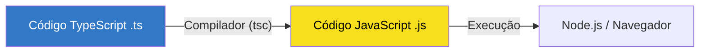

# Aula 01 - Introdução ao TypeScript e Setup Profissional 🧠

!!! tip "Objetivo"
    Nesta aula, você entenderá a evolução do JavaScript, por que o TypeScript se tornou o padrão da indústria e como configurar um ambiente de desenvolvimento profissional do zero.

---

## 1. Evolução do JavaScript e Problemas da Tipagem Dinâmica 🌊

O JavaScript nasceu em 1995 para ser uma linguagem de scripts simples para navegadores. Com o passar dos anos, ele assumiu o controle de aplicações complexas (Gmail, Facebook, VS Code). No entanto, sua natureza **dinâmica** e **fracamente tipada** traz desafios em larga escala.

### O Problema da Tipagem Dinâmica 🧨

Em JS, você pode fazer isso:

```javascript
let total = "10";
total = total + 5; // Resultado: "105" (string) em vez de 15
```

Erros como `undefined is not a function` ou `cannot read property of null` são comuns e só aparecem em **tempo de execução** (quando o usuário está usando o app).

!!! danger "Atenção"
    Erros silenciosos em JavaScript são a maior causa de bugs em produção. O TypeScript resolve isso movendo a detecção de erros para o **tempo de compilação**.

---

## 2. O que é TypeScript? 🛡️

O TypeScript é um **superset** (superconjunto) do JavaScript criado pela Microsoft. Isso significa que **todo código JavaScript é um código TypeScript válido**, mas o TS adiciona uma camada de **tipagem estática**.

### Por que usar TypeScript?
1. **Segurança**: Detecta erros antes de rodar o código.
2. **Autocompletar (IntelliSense)**: O VS Code "entende" seu código e sugere propriedades.
3. **Refatoração**: É muito mais seguro mudar nomes de funções ou variáveis em projetos grandes.

---

## 3. Setup Profissional 🛠️

Para começar, precisamos do **Node.js** instalado. O TypeScript é instalado via NPM (Node Package Manager).

### Instalação Global
<div class="termy" data-termynal>
  <span data-ty="input">npm install -g typescript</span>
  <span data-ty="progress"></span>
  <span data-ty>Added 1 package in 2s</span>
  <span data-ty="input">tsc -v</span>
  <span data-ty>Version 5.x.x</span>
</div>

!!! note "Conceito"
    O comando `tsc` é o **TypeScript Compiler**. Ele transforma seu código `.ts` em código `.js` que o navegador ou o Node conseguem entender.

---

## 4. O Coração do Projeto: `tsconfig.json` ⚙️

Todo projeto sério de TypeScript possui um arquivo de configuração chamado `tsconfig.json`. Ele define como o compilador deve se comportar.

### Criando a Configuração
<div class="termy" data-termynal>
  <span data-ty="input">tsc --init</span>
  <span data-ty>Successfully created a tsconfig.json file.</span>
</div>

!!! info "Dica"
    No `tsconfig.json`, ative sempre o `"strict": true` para garantir o máximo de segurança e as melhores práticas da linguagem.

---

## 5. Primeiro Projeto Estruturado (Laboratório) 🧪

Vamos criar nossa primeira estrutura profissional:

1. Crie uma pasta `src/` (onde ficará o código fonte).
2. Crie um arquivo `src/index.ts`.

### Visualizando o Fluxo de Trabalho (Mermaid)



### Exemplo de Código no VS Code
```typescript
interface Usuario {
    nome: string;
    id: number;
}

const novoUsuario: Usuario = {
    nome: "Ricardo",
    id: 1
};

console.log(`Olá, ${novoUsuario.nome}! Seu ID é ${novoUsuario.id}.`);
```

---

## 6. Exercícios de Fixação 📝

1. **Básico**: Instale o TypeScript na sua máquina e verifique a versão.
2. **Básico**: Crie um arquivo `ola.ts`, declare uma variável `msg: string` e imprima no console.
3. **Intermediário**: Gere o arquivo `tsconfig.json` e mude a opção `target` para `ES6`. O que isso muda no JS gerado?
4. **Intermediário**: Tente atribuir um número a uma variável declarada como string. Observe o erro no VS Code.
5. **Desafio**: Configure um script no `package.json` chamado `build` que execute o comando `tsc`.

---

## 🚀 Mini-Projeto da Aula
Configure um ambiente onde o comando `tsc -w` (watch mode) fique monitorando sua pasta `src/` e compilando automaticamente para uma pasta `dist/`.

---
**Próxima Aula**: Vamos mergulhar nos [Tipos Fundamentais e Inferência](./aula-02.md) e entender como o TS "adivinha" nossos tipos!