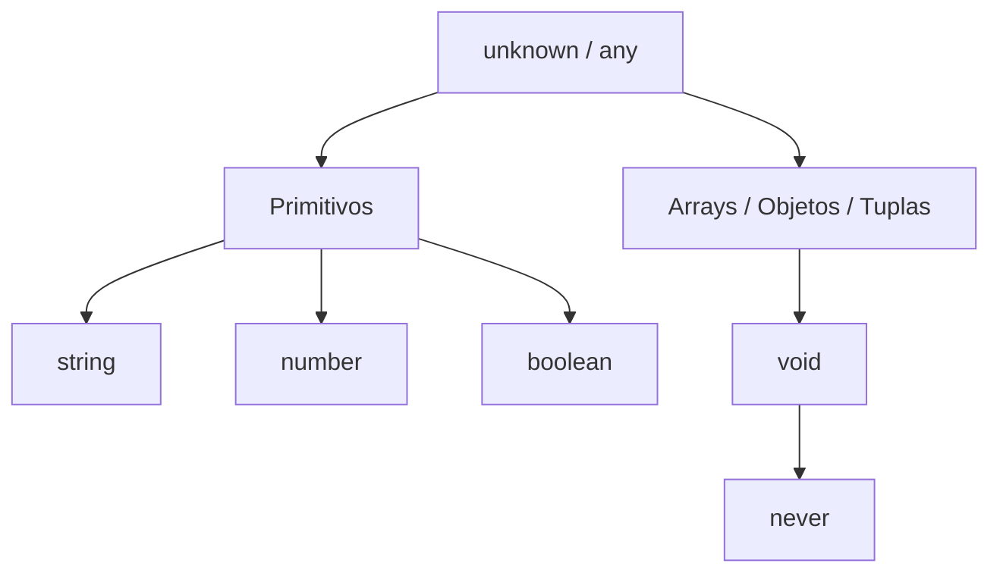

# Aula 02 - Tipos Fundamentais e Inferência 🛠️

!!! tip "Objetivo"
    Nesta aula, exploraremos os pilares da tipagem no TypeScript: os tipos primitivos, as estruturas de dados básicas e o poderoso sistema de inferência que torna o código limpo e seguro ao mesmo tempo.

---

## 1. Tipos Primitivos 🧱

O TypeScript herda os tipos primitivos do JavaScript, mas permite que você os declare explicitamente.

| Tipo | Descrição | Exemplo |
| :--- | :--- | :--- |
| `string` | Textos | `"Olá mundo"` |
| `number` | Números (inteiros e decimais) | `42` ou `3.14` |
| `boolean` | Valores lógicos | `true` ou `false` |

### Exemplo de Declaração
```typescript
let nome: string = "Analista";
let idade: number = 25;
let estaAtivo: boolean = true;
```

---

## 2. Arrays e Tuplas 📊

### Arrays
Existem duas formas de declarar arrays:
```typescript
let numeros: number[] = [1, 2, 3];
let nomes: Array<string> = ["Ana", "Bia"];
```

### Tuplas
As Tuplas permitem declarar um array com um **número fixo de elementos** e **tipos conhecidos** em posições específicas.

```typescript
let pessoa: [string, number];
pessoa = ["Ricardo", 30]; // ✅ Correto
// pessoa = [30, "Ricardo"]; // ❌ Erro: Tipos na ordem errada
```

---

## 3. Enum, Any e Unknown 🎭

### Enum
Permite definir um conjunto de constantes nomeadas, facilitando a legibilidade.

```typescript
enum Cor {
    Vermelho,
    Verde,
    Azul
}
let c: Cor = Cor.Verde;
```

### Any vs Unknown
!!! warning "Atenção"
    O tipo `any` desativa a checagem de tipos. Use apenas em casos extremos de migração de código.

*   `any`: Aceita qualquer coisa e permite qualquer operação.
*   `unknown`: Aceita qualquer coisa, mas obriga você a verificar o tipo antes de usar (mais seguro).

---

## 4. Void e Never 🚫

*   `void`: Usado em funções que não retornam nenhum valor.
*   `never`: Usado em funções que nunca terminam (como loops infinitos) ou que sempre lançam exceções.

```typescript
function avisar(): void {
    console.log("Aviso enviado!");
}

function erroFatal(msg: string): never {
    throw new Error(msg);
}
```

---

## 5. Inferência de Tipos 🧠

O TypeScript é inteligente o suficiente para entender o tipo de uma variável sem que você precise escrever.

```typescript
let curso = "TypeScript"; // O TS infere automaticamente que 'curso' é string
// curso = 10; // ❌ Erro: Não posso atribuir número a uma string
```

---

## 6. Strict Mode: O Coração da Qualidade 🛡️

Como vimos na Aula 1, o `tsconfig.json` possui o `strict mode`. Ele força o desenvolvedor a lidar com valores `null` e `undefined`, evitando os famosos erros de "quebra" em produção.

### Visualizando a Hierarquia de Tipos (Mermaid)



---

## 7. Exercícios Práticos 📝

1. **Básico**: Crie uma variável para cada tipo primitivo e atribua valores coerentes.
2. **Básico**: Crie um array de strings e uma tupla contendo o nome e a versão de um software.
3. **Intermediário**: Crie um `enum` para representar os dias da semana.
4. **Intermediário**: Crie uma função que receba um parâmetro `unknown` e use o `typeof` para imprimir se é uma string ou número.
5. **Desafio**: Tente criar uma função que retorne `never` e explique em qual cenário do mundo real ela seria útil.

---

## 🚀 Mini-Projeto da Aula
Crie um pequeno script de "Gerenciamento de Inventário" onde cada item é uma tupla `[id: number, nome: string, preco: number, emEstoque: boolean]`. Use um `enum` para as categorias dos itens.

---
**Próxima Aula**: Vamos aprender sobre [Tipos Avançados](./aula-03.md) como Union Types e Type Guards!