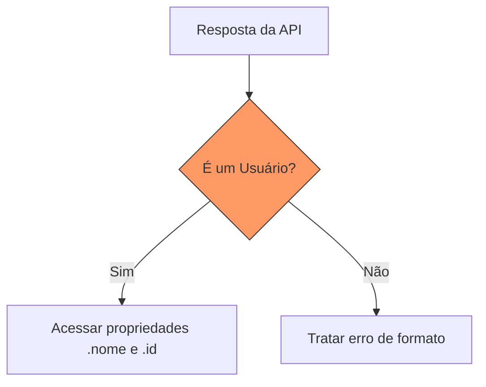

# Aula 03 – Tipos Avançados 🧩

!!! tip "Objetivo"
    Nesta aula, aprenderemos a criar tipos flexíveis e poderosos usando uniões, interseções e aliases. Também veremos como o TypeScript nos ajuda a "estreitar" os tipos para garantir que o código seja 100% seguro contra erros de runtime.

---

## 1. Union Types (|) 🔗

O **Union Type** permite que uma variável tenha mais de um tipo possível. É como dizer: "esta variável pode ser uma string OU um número".

```typescript
function imprimirId(id: number | string) {
    console.log(`Seu ID é: ${id}`);
}

imprimirId(101);    // ✅ OK
imprimirId("202");  // ✅ OK
// imprimirId(true); // ❌ Erro: boolean não é permitido
```

---

## 2. Type Alias 🏷️

Em vez de repetir tipos complexos em vários lugares, podemos criar um "apelido" usando a palavra-chave `type`.

```typescript
type ID = number | string;

function login(usuario: ID) {
    // ...
}
```

---

## 3. Intersection Types (&) 🤝

Enquanto a união é um "ou", a interseção é um "e". Ela combina múltiplos tipos em um só. É muito usada para compor objetos.

```typescript
type Pessoa = { nome: string };
type Empregado = { cargo: string };

type Desenvolvedor = Pessoa & Empregado;

const ricardo: Desenvolvedor = {
    nome: "Ricardo",
    cargo: "Tech Lead"
};
```

---

## 4. Literal Types 🎯

Podemos definir valores exatos que uma variável pode assumir. Isso é excelente para estados ou configurações.

```typescript
type Alinhamento = "esquerda" | "centro" | "direita";

let texto: Alinhamento = "centro"; // ✅ OK
// texto = "cima"; // ❌ Erro: "cima" não está na lista
```

---

## 5. Narrowing e Type Guards 🛡️

**Narrowing** (Estreitamento) é o processo de o TypeScript "entender" qual é o tipo exato dentro de um fluxo lógico. Isso é feito usando **Type Guards**.

### Exemplo com `typeof`
```typescript
function processar(entrada: string | number) {
    if (typeof entrada === "string") {
        console.log(entrada.toUpperCase()); // Aqui o TS sabe que é string
    } else {
        console.log(entrada.toFixed(2)); // Aqui o TS sabe que é number
    }
}
```

---

## 6. Estudo de Caso: Validação de Dados de API 📡

Ao receber dados de uma API, muitas vezes não sabemos o formato exato. Usar tipos avançados nos protege.

### Visualizando a Validação (Mermaid)



---

## 7. Exercícios Práticos 📝

1. **Básico**: Crie um Type Alias chamado `Status` que aceite os literais "ativo", "pendente" ou "inativo".
2. **Básico**: Crie uma função que receba um parâmetro que pode ser `number` ou `null` e retorne o dobro se for número ou 0 se for null.
3. **Intermediário**: Crie dois tipos, `Carro` e `Eletrico`, e use uma interseção para criar um `CarroEletrico`.
4. **Intermediário**: Use o operador `in` como Type Guard para verificar se uma propriedade existe em um objeto.
5. **Desafio**: Crie uma função de validação de API que receba um objeto `any` e use Type Guards para transformá-lo em um tipo `Produto` seguro.

---

## 🚀 Mini-Projeto da Aula
Crie um sistema de "Notificações". O sistema deve aceitar notificações por Email ou SMS. 
- Email tem `endereco` e `assunto`.
- SMS tem `numero` e `mensagem`.
Use Union Types e Narrowing para processar o envio corretamente.

---
**Próxima Aula**: Vamos explorar [Interfaces e Modelagem de Domínio](./aula-04.md) e entender a diferença entre `interface` e `type`!