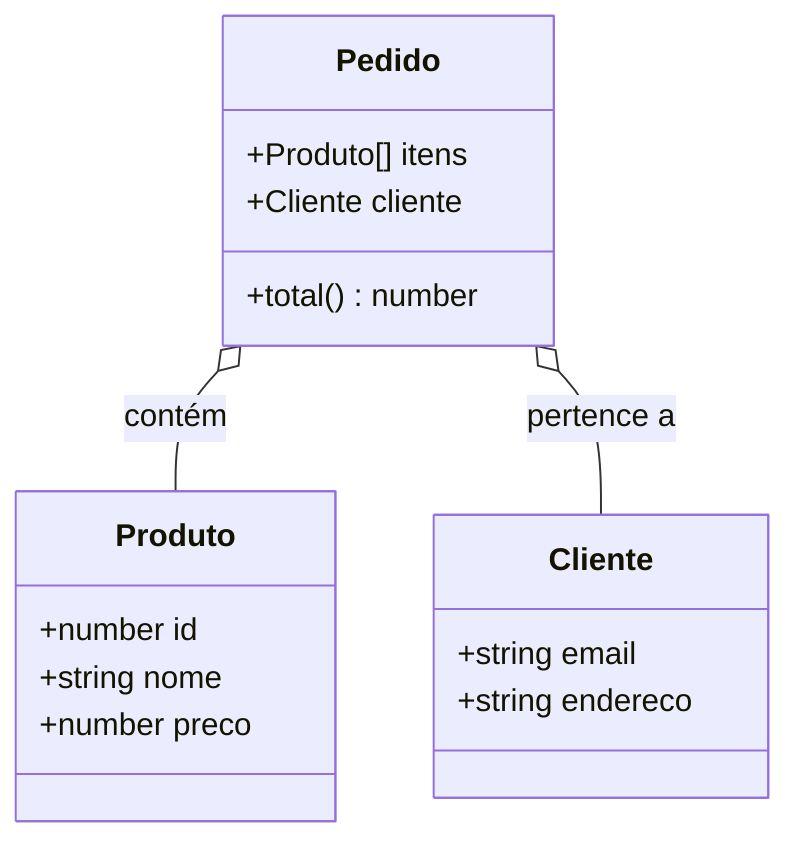

# Aula 04 – Interfaces e Modelagem de Domínio 🏗️

!!! tip "Objetivo"
    Nesta aula, aprenderemos a modelar objetos complexos usando Interfaces. Entenderemos a diferença entre `interface` e `type` e como construir contratos sólidos para aplicações corporativas.

---

## 1. O que são Interfaces? 📜

Uma **Interface** é um contrato que define a estrutura de um objeto. Ela diz quais propriedades e métodos um objeto deve ter, mas não como eles são implementados.

```typescript
interface Livro {
    titulo: string;
    autor: string;
    paginas?: number; // Propriedade opcional
    readonly isbn: string; // Propriedade apenas de leitura
}

const meuLivro: Livro = {
    titulo: "Clean Code",
    autor: "Robert C. Martin",
    isbn: "123-456-789"
};
```

---

## 2. Extensão de Interfaces (Herança de Contratos) 🧬

Podemos combinar interfaces para criar estruturas mais complexas e reutilizáveis.

```typescript
interface Animal {
    nome: string;
}

interface Mamifero extends Animal {
    amamentar(): void;
}

const cachorro: Mamifero = {
    nome: "Rex",
    amamentar: () => console.log("Amamentando...")
};
```

---

## 3. Implementação em Classes 🏛️

As interfaces são fundamentais na Programação Orientada a Objetos (POO). Uma classe pode "assinar" um contrato de interface usando a palavra-chave `implements`.

```typescript
interface Autenticavel {
    login(): boolean;
}

class Usuario implements Autenticavel {
    login(): boolean {
        console.log("Usuário logado!");
        return true;
    }
}
```

---

## 4. Diferença entre Interface e Type Alias ⚖️

Ambos são muito parecidos, mas existem diferenças fundamentais:

| Característica | Interface | Type Alias |
| :--- | :--- | :--- |
| **Extensibilidade** | Pode ser estendida via `extends`. | Pode ser combinada via interseção (`&`). |
| **Declaration Merging** | Se você definir duas com o mesmo nome, elas se fundem. | Não permite nomes duplicados. |
| **Ideal para** | Modelagem de objetos e POO. | Uniões, Primitivos, Funções e Tipos complexos. |

!!! note "Dica Profissional"
    A recomendação oficial do TypeScript é: use **Interface** até que você precise de uma funcionalidade específica do **Type**.

---

## 5. Modelagem de Domínio (Entidades) 🗺️

Modelar o domínio é definir as "regras de negócio" através dos tipos. Em um e-commerce, teríamos:

### Visualizando o Domínio (Mermaid)



---

## 6. Exercícios Práticos 📝

1. **Básico**: Crie uma interface `Funcionario` com propriedades `nome`, `salario` e uma propriedade opcional `bonus`.
2. **Básico**: Crie uma interface `Veiculo` e use `extends` para criar uma interface `Moto`.
3. **Intermediário**: Tente usar o "Declaration Merging" criando duas interfaces `Usuario` em partes diferentes do código e veja como o TS as une.
4. **Intermediário**: Crie uma interface para uma função que recebe dois números e retorna a soma deles.
5. **Desafio**: Modele um sistema de biblioteca. Crie interfaces para `Autor`, `Livro` e `Emprestimo`. Garanta que um empréstimo tenha uma data de início e uma data de devolução.

---

## 🚀 Mini-Projeto da Aula
Modele as entidades de um **Sistema de Gestão Acadêmica**.
- Interfaces para: `Aluno`, `Professor`, `Disciplina` e `Turma`.
- Uma turma deve conter um professor e uma lista de alunos.
- Utilize propriedades `readonly` para IDs que não podem ser alterados.

---
**Próxima Aula**: Vamos subir o nível com [Classes e Programação Orientada a Objetos](./aula-05.md) no TypeScript!