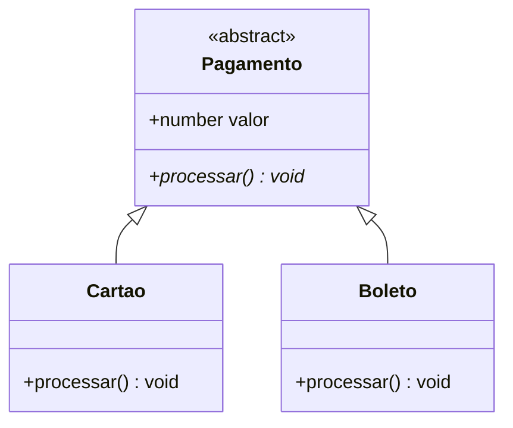

# Aula 05 – Classes e Programação Orientada a Objetos 🏛️

!!! tip "Objetivo"
    Nesta aula, aplicaremos os conceitos de Programação Orientada a Objetos (POO) no TypeScript. Veremos como encapsular dados, usar modificadores de acesso e criar abstrações poderosas para sistemas escaláveis.

---

## 1. Modificadores de Acesso 🔒

Diferente do JavaScript puro, o TypeScript oferece modificadores que controlam quem pode acessar as propriedades e métodos de uma classe.

| Modificador | Descrição |
| :--- | :--- |
| `public` | (Padrão) Acesso total de qualquer lugar. |
| `private` | Acesso apenas dentro da própria classe. |
| `protected` | Acesso dentro da classe e de suas subclasses (herança). |

```typescript
class ContaBancaria {
    private saldo: number = 0; // Ninguém fora da classe mexe aqui

    public depositar(valor: number): void {
        this.saldo += valor;
    }
}
```

---

## 2. Parâmetros Readonly e Shorthand Syntax ⚡

O TypeScript nos permite declarar e inicializar propriedades diretamente no construtor.

```typescript
class Usuario {
    constructor(
        public readonly id: number,
        private nome: string
    ) {}
}

const u = new Usuario(1, "Ricardo");
// u.id = 2; // ❌ Erro: Propriedade é readonly
```

---

## 3. Getters e Setters 🔄

Permitem aplicar lógica ao ler ou alterar um valor.

```typescript
class Produto {
    private _preco: number = 0;

    get preco() { return this._preco; }

    set preco(valor: number) {
        if (valor < 0) throw new Error("Preço inválido!");
        this._preco = valor;
    }
}
```

---

## 4. Herança e Polimorfismo 🧬

A herança permite que uma classe herde comportamentos de outra, facilitando a reutilização de código.

```typescript
class Funcionario {
    constructor(public nome: string) {}
    getBonus() { return 1000; }
}

class Gerente extends Funcionario {
    getBonus() { return super.getBonus() + 5000; } // Polimorfismo
}
```

---

## 5. Classes Abstratas ☁️

Uma classe abstrata não pode ser instanciada diretamente. Ela serve como um "esqueleto" para outras classes.

### Visualizando a Abstração (Mermaid)



---

## 6. Exercícios Práticos 📝

1. **Básico**: Crie uma classe `Carro` com propriedades `marca`, `modelo` e um método `acelerar`.
2. **Básico**: Use o modificador `private` em uma propriedade `velocidade` e crie um getter para ela.
3. **Intermediário**: Crie uma classe `Animal` abstrata com um método abstrato `fazerSom()` e implemente-o nas classes `Cachorro` e `Gato`.
4. **Intermediário**: Crie uma classe `Pessoa` e uma subclasse `Estudante`. Use o `super()` no construtor da subclasse.
5. **Desafio**: Crie um sistema de "Contas". Uma `Conta` abstrata e subclasses `ContaCorrente` e `ContaPoupanca`. A `ContaCorrente` deve cobrar uma taxa em cada saque.

---

## 🚀 Mini-Projeto da Aula
Desenvolva um **Sistema de RPG Simples**.
- Crie uma classe base `Personagem` com `nome`, `vida` e `ataque`.
- Crie subclasses `Guerreiro` (mais vida) e `Mago` (mais ataque).
- Use encapsulamento para garantir que a vida nunca fique negativa.

---
**Próxima Aula**: Vamos aprender sobre [Generics](./aula-06.md) e como criar código que funciona com qualquer tipo!