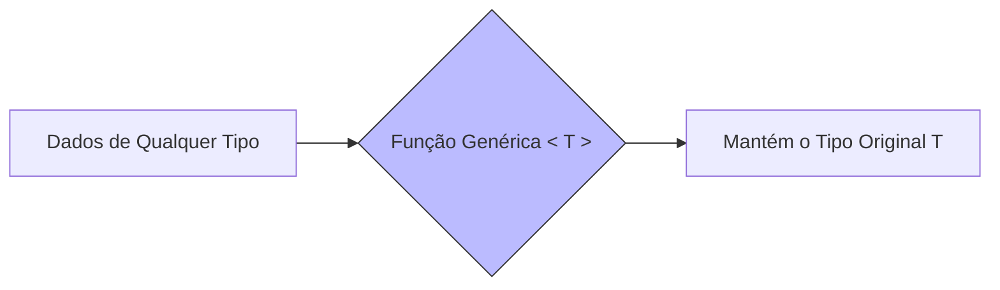

# Aula 06 – Generics (Programação Genérica) 📦

!!! tip "Objetivo"
    Nesta aula, desvendaremos o poder dos Generics. Você aprenderá a criar códigos altamente reutilizáveis e flexíveis que mantêm a segurança de tipos, independentemente do dado que estão processando.

---

## 1. O que são Generics? 🧬

**Generics** permitem que componentes (funções, classes ou interfaces) funcionem com uma variedade de tipos, ao invés de apenas um. Pense neles como "parâmetros para tipos".

### O problema sem Generics
```typescript
function retornarPrimeiro(lista: any[]): any {
    return lista[0];
}
// ❌ Perdemos a informação do tipo original
```

### A solução com Generics
```typescript
function retornarPrimeiro<T>(lista: T[]): T {
    return lista[0];
}

const n = retornarPrimeiro([1, 2, 3]); // n é inferido como number
const s = retornarPrimeiro(["a", "b"]); // s é inferido como string
```

---

## 2. Constraints (Restrições) ⛓️

Nem sempre queremos que o Generic aceite "qualquer" tipo. Podemos restringir o que ele aceita usando a palavra-chave `extends`.

```typescript
interface TemComprimento {
    length: number;
}

function logComprimento<T extends TemComprimento>(obj: T) {
    console.log(obj.length);
}

logComprimento("Olá"); // ✅ OK (string tem length)
logComprimento([1, 2]); // ✅ OK (array tem length)
// logComprimento(10); // ❌ Erro: number não tem length
```

---

## 3. Classes Genéricas 🏗️

Classes também podem se beneficiar dessa flexibilidade. Um exemplo comum são as Pilhas ou Filas.

```typescript
class Caixa<T> {
    private conteudo?: T;

    guardar(item: T) { this.conteudo = item; }
    pegar() { return this.conteudo; }
}

const caixaDeNumeros = new Caixa<number>();
caixaDeNumeros.guardar(10);
```

---

## 4. Generics com Interfaces 📜

Podemos tornar nossas interfaces adaptáveis a diferentes tipos de resposta, muito comum em APIs.

```typescript
interface RespostaAPI<T> {
    data: T;
    erro: string | null;
}

const respostaUsuario: RespostaAPI<{nome: string}> = {
    data: { nome: "Ricardo" },
    erro: null
};
```

---

## 5. Visualizando o Fluxo Genérico (Mermaid)



---

## 6. Exercícios Práticos 📝

1. **Básico**: Crie uma função genérica `identidade<T>` que receba um argumento de tipo `T` e retorne exatamente esse argumento.
2. **Básico**: Crie um array genérico de strings.
3. **Intermediário**: Crie uma função genérica que receba dois argumentos e retorne um array contendo ambos.
4. **Intermediário**: Use constraints para garantir que um tipo genérico possua a propriedade `id: number`.
5. **Desafio**: Crie uma interface `ListaPaginada<T>` que contenha um array de `itens: T[]` e uma propriedade `total: number`.

---

## 🚀 Mini-Projeto da Aula
Crie um **Repositório Genérico de Dados**.
- O repositório deve ter métodos para: `salvar(item: T)`, `obterTodos(): T[]` e `buscarPorId(id: number): T | undefined`.
- Teste o repositório criando uma instância para `Produtos` e outra para `Usuarios`.

---
**Próxima Aula**: Vamos explorar os [Utility Types](./aula-07.md) e descobrir como transformar tipos existentes de forma mágica!