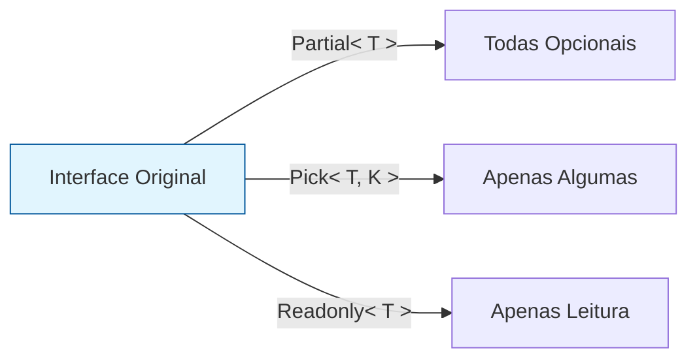

# Aula 07 – Utility Types e Manipulação de Tipos ⚙️

!!! tip "Objetivo"
    Nesta aula, conheceremos os utilitários integrados do TypeScript que facilitam a transformação de tipos existentes. Eles são essenciais para manter o código DRY (Don't Repeat Yourself) e flexível.

---

## 1. O que são Utility Types? 🛠️

Os **Utility Types** são tipos globais fornecidos pelo TypeScript que permitem realizar mapeamentos e transformações comuns de forma simples e segura.

---

## 2. Utilitários de Propriedades 📋

### Partial<T>
Torna todas as propriedades de um tipo opcionais. Útil para atualizações parciais de dados.

```typescript
interface Usuario {
    id: number;
    nome: string;
    email: string;
}

const atualizar: Partial<Usuario> = { nome: "Novo Nome" };
```

### Required<T>
O oposto do Partial. Torna todas as propriedades obrigatórias.

### Readonly<T>
Torna todas as propriedades apenas de leitura, impedindo alterações após a atribuição inicial.

---

## 3. Utilitários de Seleção ✂️

### Pick<T, K>
Cria um novo tipo escolhendo apenas algumas propriedades do tipo original.

```typescript
type ResumoUsuario = Pick<Usuario, "nome" | "email">;
```

### Omit<T, K>
Cria um novo tipo removendo as propriedades especificadas.

```typescript
type UsuarioSemId = Omit<Usuario, "id">;
```

---

## 4. Utilitários de Estrutura 🏗️

### Record<K, T>
Cria um tipo de objeto onde as chaves são do tipo `K` e os valores são do tipo `T`.

```typescript
type Configuracoes = Record<"tema" | "idioma", string>;

const config: Configuracoes = {
    tema: "dark",
    idioma: "pt-BR"
};
```

---

## 5. Mapped Types (Breve Introdução) 🗺️

Os Utility Types acima são construídos usando **Mapped Types**. Eles permitem que você percorra as propriedades de um tipo e crie um novo.

### Visualizando a Transformação (Mermaid)



---

## 6. Exercícios Práticos 📝

1. **Básico**: Use `Partial` para criar uma função que aceite uma atualização parcial de um objeto `Produto`.
2. **Básico**: Crie uma interface `Config` com propriedades opcionais e use `Required` para garantir que todas estejam presentes em uma variável.
3. **Intermediário**: Use `Pick` para extrair apenas o `titulo` e a `data` de uma interface `Post`.
4. **Intermediário**: Use `Record` para criar um dicionário de traduções onde as chaves são "ola" e "tchau" e os valores são strings.
5. **Desafio**: Combine `Omit` e `Readonly` para criar um tipo de dado que não contenha o ID de um `Usuario` e seja imutável.

---

## 🚀 Mini-Projeto da Aula
Crie um **Transformador de Modelos**.
- Defina uma interface robusta para um `Pedido`.
- Crie um tipo para a visualização resumida do pedido (`Pick`).
- Crie um tipo para a criação de um pedido (onde campos como `id` e `dataGeracao` são omitidos via `Omit`).
- Garanta que os dados da API sejam de apenas leitura (`Readonly`).

---
**Próxima Aula**: Vamos mergulhar na [Manipulação Avançada de Tipos](./aula-08.md) e entender tipos condicionais e o operador `infer`!