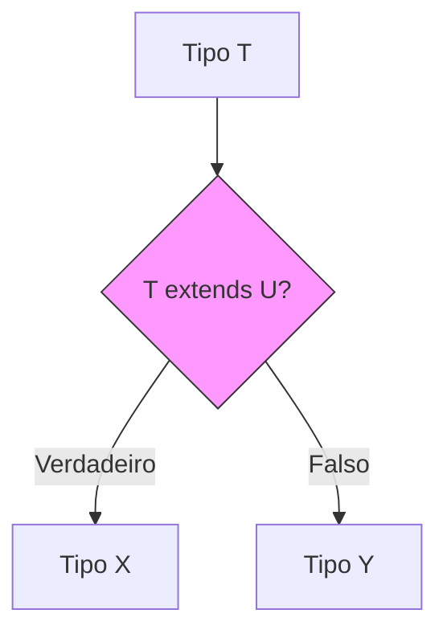

# Aula 08 – Manipulação Avançada de Tipos 🧪

!!! tip "Objetivo"
    Nesta aula, exploraremos as funcionalidades mais avançadas do sistema de tipos do TypeScript. Aprenderemos a criar tipos que dependem de condições, extrair tipos de funções e gerar strings de tipos dinamicamente.

---

## 1. keyof e Indexed Access Types 🔑

### Operador keyof
O operador `keyof` obtém todas as chaves de um tipo de objeto e as transforma em uma união de literais.

```typescript
interface Carro {
    marca: string;
    ano: number;
}

type ChavesDoCarro = keyof Carro; // "marca" | "ano"
```

### Indexed Access Types
Permite acessar o tipo de uma propriedade específica de outro tipo.

```typescript
type TipoMarca = Carro["marca"]; // string
```

---

## 2. Tipos Condicionais 🛠️

Funcionam como um "if" para tipos. A sintaxe é similar ao operador ternário.

```typescript
type EString<T> = T extends string ? "Sim" : "Não";

type Teste1 = EString<string>; // "Sim"
type Teste2 = EString<number>; // "Não"
```

---

## 3. O Operador infer 🔍

Usado dentro de tipos condicionais para "inferir" e extrair um tipo de dentro de outro (como o tipo de retorno de uma função).

```typescript
type RetornoDeFuncao<T> = T extends (...args: any[]) => infer R ? R : any;

function soma(a: number, b: number): number { return a + b; }
type ResultadoSoma = RetornoDeFuncao<typeof soma>; // number
```

---

## 4. Template Literal Types 🖋️

Permitem criar novos tipos de string baseados em uniões de strings, usando a mesma sintaxe de template strings do JS.

```typescript
type Cor = "vermelho" | "azul";
type Intensidade = "claro" | "escuro";

type CorCompleta = `${Cor}-${Intensidade}`; 
// "vermelho-claro" | "vermelho-escuro" | "azul-claro" | "azul-escuro"
```

---

## 5. Visualizando a Lógica Condicional (Mermaid)



---

## 6. Exercícios Práticos 📝

1. **Básico**: Use `keyof` para criar uma função que receba um objeto e uma de suas chaves e retorne o valor daquela chave.
2. **Básico**: Use `Indexed Access Types` para obter o tipo de um elemento dentro de um array de strings.
3. **Intermediário**: Crie um tipo condicional que verifique se um tipo é um array. Se for, retorne o tipo dos itens; se não, retorne o próprio tipo.
4. **Intermediário**: Use `Template Literal Types` para gerar todas as combinações de chaves de um objeto CSS (ex: `margin-top`, `margin-bottom`, etc.).
5. **Desafio**: Use `infer` para criar um tipo que extraia o tipo do primeiro argumento de uma função.

---

## 🚀 Mini-Projeto da Aula
Crie um **Gerador de Tipos Dinâmicos para APIs**.
- Use `Template Literal Types` para criar rotas de API baseadas em recursos (ex: `get-user`, `post-user`).
- Use tipos condicionais para definir se a resposta de uma função deve ser um objeto ou um erro mapeado.
- Utilize `keyof` para validar se os filtros de busca enviados para a API pertencem ao modelo de dados.

---
**Próxima Aula**: Vamos organizar nossos projetos em [Módulos e Organização Profissional](./aula-09.md) de forma escalável!