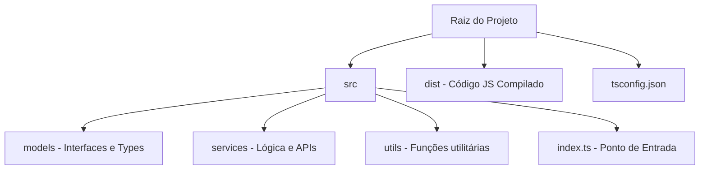

# Aula 09 – Módulos e Organização Profissional 📁

!!! tip "Objetivo"
    Nesta aula, aprenderemos a organizar código TypeScript de forma modular e escalável. Veremos como usar ES Modules, criar "Barrel Files" e configurar apelidos para caminhos, facilitando a manutenção de projetos grandes.

---

## 1. ES Modules (import/export) 📦

O TypeScript segue o padrão oficial do JavaScript para módulos (ESM). Isso permite que dividamos o código em vários arquivos e importemos apenas o que for necessário.

### Exportando
```typescript
// math.ts
export function somar(a: number, b: number) { return a + b; }
export const PI = 3.14;
```

### Importando
```typescript
// main.ts
import { somar, PI } from "./math";
console.log(somar(10, PI));
```

---

## 2. Barrel Files (O arquivo index.ts) 🛢️

Um **Barrel File** é uma forma de consolidar múltiplos módulos em um único arquivo de saída, simplificando os imports no restante da aplicação.

### Estrutura
```text
/models
  index.ts (Barrel)
  usuario.ts
  produto.ts
```

### Exemplo no index.ts
```typescript
export * from "./usuario";
export * from "./produto";
```

Agora você pode importar tudo de `/models` em vez de cada arquivo individualmente.

---

## 3. Namespaces (Legado vs Moderno) 🏛️

Antigamente, usava-se muito o `namespace` para organizar o código. Hoje, com o ES Modules, eles são menos comuns, mas ainda aparecem em bibliotecas legadas ou definições de tipos.

```typescript
namespace Validacao {
    export const emailRegex = /.../;
}
```

---

## 4. Path Aliases (Apelidos de Caminho) 🗺️

Em projetos grandes, os imports podem ficar confusos: `../../../../services/api`. Podemos configurar o `tsconfig.json` para criar apelidos.

### Configuração no tsconfig.json
```json
{
  "compilerOptions": {
    "baseUrl": "./src",
    "paths": {
      "@services/*": ["services/*"],
      "@models/*": ["models/*"]
    }
  }
}
```

---

## 5. Estruturação de Projeto Profissional 🏗️

### Visualizando a Estrutura (Mermaid)



---

## 6. Exercícios Práticos 📝

1. **Básico**: Crie dois arquivos: um que exporte uma classe e outro que a importe e instancie.
2. **Básico**: Use o `export default` para exportar uma função e importe-a com um nome diferente.
3. **Intermediário**: Crie uma pasta `utils`, adicione três funções em arquivos separados e crie um "Barrel File" (`index.ts`) para exportá-las.
4. **Intermediário**: Tente configurar um `path alias` no seu `tsconfig.json` e use-o em um import.
5. **Desafio**: Refatore um projeto pequeno que use apenas um arquivo para a estrutura profissional sugerida no diagrama acima.

---

## 🚀 Mini-Projeto da Aula
Organize um **Sistema de Cadastro de Clientes**.
- Crie uma pasta `domain` para as interfaces.
- Crie uma pasta `data` para o repositório.
- Crie uma pasta `shared` para funções utilitárias (ex: formatadores de CPF).
- Use Barrel Files em cada pasta para exportar as funcionalidades de forma limpa.

---
**Próxima Aula**: Vamos colocar o TypeScript para rodar no lado do servidor com [TypeScript com Node.js (Backend)](./aula-10.md)!