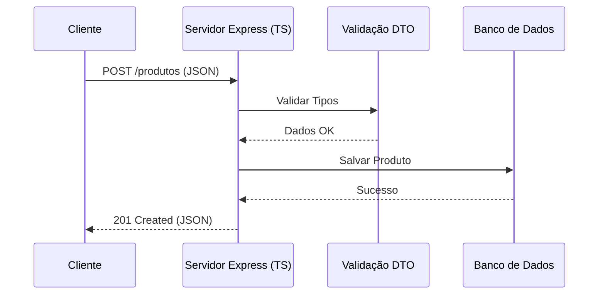

# Aula 10 – TypeScript com Node.js (Backend) 🟢

!!! tip "Objetivo"
    Nesta aula, aprenderemos a utilizar o TypeScript no desenvolvimento backend com Node.js. Veremos como configurar o ambiente, tipar requisições do Express, usar DTOs e garantir a segurança dos dados que entram na nossa API.

---

## 1. Configuração do Ambiente Backend 🛠️

Para rodar TypeScript no Node.js de forma eficiente, usamos ferramentas como `ts-node-dev` para desenvolvimento e `tsc` para produção.

### Instalação das Dependências
<div class="termy" data-termynal>
  <span data-ty="input">npm install express</span>
  <span data-ty="input">npm install -D @types/express typescript ts-node-dev</span>
</div>

!!! note "O que são @types?"
    Como muitas bibliotecas JS não foram escritas em TS, a comunidade mantém o repositório **DefinitelyTyped**. O pacote `@types/express` fornece as definições de tipo para que o TS entenda o Express.

---

## 2. Tipagem de Requisições e Respostas 📨

O Express no TypeScript permite que tipemos os parâmetros, o corpo da requisição e a resposta.

```typescript
import express, { Request, Response } from 'express';

const app = express();
app.use(express.json());

app.post('/usuarios', (req: Request, res: Response) => {
    const { nome } = req.body; // req.body aqui é 'any' por padrão
    return res.status(201).json({ mensagem: `Usuário ${nome} criado!` });
});
```

---

## 3. DTOs (Data Transfer Objects) e Validação 🛡️

Para evitar o uso de `any` e garantir que os dados recebidos são válidos, usamos o padrão **DTO**.

```typescript
interface CriarUsuarioDTO {
    nome: string;
    email: string;
    idade: number;
}

app.post('/usuarios', (req: Request, res: Response) => {
    const dados: CriarUsuarioDTO = req.body;
    // Agora temos autocompletar e segurança de tipos em 'dados'
});
```

---

## 4. Middleware Tipado 🧩

Middlewares são funções que rodam entre a requisição e a resposta. Eles também devem ser tipados.

```typescript
import { NextFunction } from 'express';

function loggerMiddleware(req: Request, res: Response, next: NextFunction) {
    console.log(`[${req.method}] ${req.url}`);
    next();
}
```

---

## 5. Visualizando o Fluxo da API (Mermaid)



---

## 6. Exercícios Práticos 📝

1. **Básico**: Configure um novo projeto Node.js com TypeScript e instale os tipos do Express.
2. **Básico**: Crie uma rota `GET` que retorne um objeto tipado com informações do servidor.
3. **Intermediário**: Crie uma interface `ProdutoDTO` e use-a para tipar o `req.body` de uma rota de criação.
4. **Intermediário**: Implemente um middleware que verifica se um `token` está presente no header da requisição.
5. **Desafio**: Crie uma mini API que gerencia uma lista em memória de "Tarefas" (Tasks). Use interfaces para as tarefas e garanta que as rotas de `POST` e `PUT` usem DTOs.

---

## 🚀 Mini-Projeto da Aula
Desenvolva uma **Mini API REST de Biblioteca**.
- Rotas para listar, criar e buscar livros por ID.
- Use um `array` em memória para simular o banco de dados.
- Tipagem completa de Requests, Responses e Entidades.
- Implemente um tratamento de erros centralizado que use o tipo `Error`.

---
**Próxima Aula**: Vamos levar o TypeScript para o navegador com [TypeScript com Frontend Moderno](./aula-11.md) (React/Vue/Angular)!