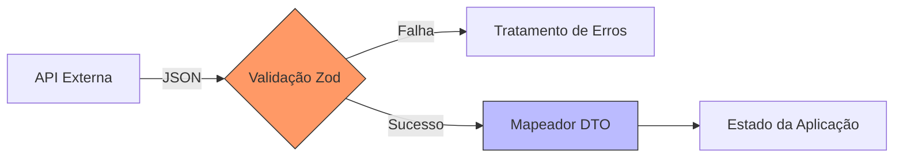

# Aula 12 – Integração com APIs e Tipagem de Dados Externos 📡

!!! tip "Objetivo"
    Nesta aula, aprenderemos a consumir serviços externos garantindo a integridade dos dados. Veremos como tipar respostas do Axios/Fetch, usar o padrão DTO para transformar dados e introduziremos a validação em runtime com bibliotecas como o Zod.

---

## 1. Fetch e Axios com TypeScript 🌐

Ao fazer uma requisição, o TypeScript não sabe o que virá da rede. Precisamos informar o tipo esperado para ter segurança ao manipular a resposta.

### Exemplo com Axios
```typescript
import axios from 'axios';

interface Usuario {
    id: number;
    name: string;
    email: string;
}

async function buscarUsuario(id: number): Promise<Usuario> {
    const { data } = await axios.get<Usuario>(`https://api.exemplo.com/users/${id}`);
    return data;
}
```

---

## 2. O Padrão DTO (Data Transfer Object) 🔄

Muitas vezes, a API retorna dados em um formato bruto que não queremos usar diretamente no nosso frontend ou lógica de negócio. O DTO serve para mapear esses dados.

```typescript
interface UsuarioAPI {
    id: number;
    full_name: string;
    user_email: string;
}

interface UsuarioApp {
    id: number;
    nome: string;
    email: string;
}

function mapToApp(user: UsuarioAPI): UsuarioApp {
    return {
        id: user.id,
        nome: user.full_name,
        email: user.user_email
    };
}
```

---

## 3. Validação em Runtime com Zod 🛡️

O TypeScript remove os tipos no build final. Para garantir que os dados externos são realmente o que dizem ser enquanto o app roda, usamos o **Zod**.

### Criando um Schema
```typescript
import { z } from 'zod';

const UsuarioSchema = z.object({
    id: z.number(),
    nome: z.string().min(3),
    email: z.string().email()
});

type Usuario = z.infer<typeof UsuarioSchema>;

// Validação
const resultado = UsuarioSchema.safeParse(dadosExternos);
if (!resultado.success) {
    console.error("Dados inválidos!", resultado.error);
}
```

---

## 4. Tratamento de Erros de API ⚠️

Devemos tipar os erros para dar um feedback útil ao usuário.

```typescript
try {
    const user = await buscarUsuario(1);
} catch (error) {
    if (axios.isAxiosError(error)) {
        console.error("Erro na API:", error.response?.data.message);
    } else {
        console.error("Erro inesperado:", error);
    }
}
```

---

## 5. Visualizando o Ciclo de Dados (Mermaid)



---

## 6. Exercícios Práticos 📝

1. **Básico**: Crie uma interface para a resposta da API JSONPlaceholder (objetos de `Post`).
2. **Básico**: Use o `fetch` para buscar dados e exiba o título do primeiro post no console (tipado).
3. **Intermediário**: Crie uma função que receba um objeto de API "sujo" e retorne um objeto "limpo" usando o padrão DTO.
4. **Intermediário**: Instale o Zod e crie um schema para um objeto `Produto`. Tente validar um objeto que falte propriedades obrigatórias.
5. **Desafio**: Implemente uma função genérica `request<T>(url: string)` que use Axios e retorne uma `Promise<T>`, tratando erros de rede automaticamente.

---

## 🚀 Mini-Projeto da Aula
Desenvolva um **Buscador de Repositórios do GitHub**.
- Use a API pública do GitHub (`https://api.github.com/users/USUARIO/repos`).
- Crie interfaces para o `Repositorio`.
- Valide os dados recebidos com Zod.
- Exiba a lista de repositórios (nome, descrição e estrelas) em uma interface React ou no console do Node de forma tipada.

---
**Próxima Aula**: Vamos garantir que nosso código continue funcionando com [Testes com TypeScript](./aula-13.md)!