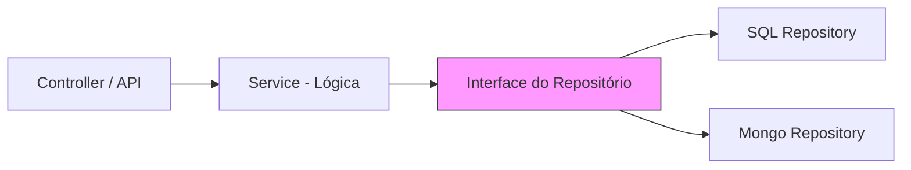

# Aula 14 – Padrões de Projeto com TypeScript 🛡️

!!! tip "Objetivo"
    Nesta aula, aprenderemos a elevar a qualidade do nosso software aplicando Padrões de Projeto (Design Patterns). Veremos como o TypeScript facilita a implementação de arquiteturas robustas usando Repositories, Services e Injeção de Dependência.

---

## 1. Padrão Repository e Service Layer 🏗️

A separação de responsabilidades é essencial. O **Repository** cuida do acesso aos dados, enquanto o **Service** cuida da lógica de negócio.

### Estrutura
- **Repository**: `buscarTodos()`, `salvar()`.
- **Service**: `criarNovoUsuario()`, `validarRegrasDeNegocio()`.

```typescript
interface IUsuarioRepository {
    salvar(usuario: Usuario): Promise<void>;
}

class UsuarioService {
    constructor(private repo: IUsuarioRepository) {}

    async registrar(nome: string) {
        // Lógica de negócio aqui
        await this.repo.salvar({ nome });
    }
}
```

---

## 2. Injeção de Dependência (DI) 💉

Em vez de criar as dependências dentro da classe, nós as "injetamos" (geralmente pelo construtor). Isso torna o código mais fácil de testar (usando mocks).

```typescript
// No mundo real, usamos frameworks como Inversify ou Nestjs
const meuRepo = new SqlUsuarioRepository();
const meuServico = new UsuarioService(meuRepo);
```

---

## 3. Padrão Factory 🏭

Usado quando a criação de um objeto é complexa ou depende de condições.

```typescript
class PagamentoFactory {
    static criar(tipo: "cartao" | "boleto") {
        if (tipo === "cartao") return new PagamentoCartao();
        return new PagamentoBoleto();
    }
}
```

---

## 4. Padrão Strategy ♟️

Permite definir uma família de algoritmos, colocá-los em classes separadas e tornar seus objetos intercambiáveis.

```typescript
interface EstrategiaDesconto {
    calcular(valor: number): number;
}

class DescontoBlackFriday implements EstrategiaDesconto {
    calcular(valor: number) { return valor * 0.5; }
}
```

---

## 5. Visualizando o Padrão Repository (Mermaid)



---

## 6. Exercícios Práticos 📝

1. **Básico**: Crie uma classe `LogService` e use injeção de dependência para passá-la para outra classe.
2. **Básico**: Implemente um `Factory` que crie diferentes tipos de `Notificacao` (Email, SMS).
3. **Intermediário**: Implemente o padrão `Strategy` para diferentes formas de calcular o frete (Normal, Expresso).
4. **Intermediário**: Crie uma interface `IUserRepository` e implemente uma versão `InMemoryUserRepository`.
5. **Desafio**: Refatore o Mini-Projeto da Aula 10 aplicando os padrões Repository e Service Layer.

---

## 🚀 Mini-Projeto da Aula
Implemente um **Sistema de Processamento de Pagamentos**.
- Use o padrão **Factory** para criar o método de pagamento.
- Use o padrão **Strategy** para aplicar diferentes taxas dependendo do método.
- Use **Injeção de Dependência** para passar o serviço de log para o processador de pagamentos.
- Tudo deve ser 100% tipado com interfaces.

---
**Próxima Aula**: Vamos aprender a escrever código limpo e entender a arquitetura em [Clean Code e Arquitetura](./aula-15.md)!