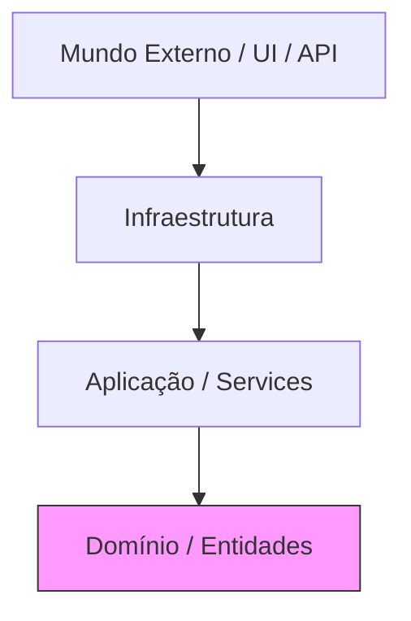

# Aula 15 – Clean Code e Arquitetura 📐

!!! tip "Objetivo"
    Nesta aula, consolidaremos os conhecimentos técnicos com os princípios de código limpo e arquitetura. Aprenderemos a aplicar o SOLID, organizar o projeto em camadas e entenderemos os fundamentos do Domain-Driven Design (DDD).

---

## 1. Princípios SOLID com TypeScript 💎

O SOLID é um conjunto de cinco princípios que tornam o software mais compreensível, flexível e sustentável.

| Letra | Princípio | Descrição no TS |
| :---: | :--- | :--- |
| **S** | Single Responsibility | Uma classe/função deve ter apenas uma razão para mudar. |
| **O** | Open/Closed | Aberto para extensão, fechado para modificação. |
| **L** | Liskov Substitution | Subclasses devem ser substituíveis por suas classes base. |
| **I** | Interface Segregation | Muitas interfaces específicas são melhores que uma geral. |
| **D** | Dependency Inversion | Dependa de abstrações (interfaces), não de implementações. |

---

## 2. Separação de Responsabilidades e Camadas 🏢

Uma aplicação profissional é dividida em camadas para facilitar a manutenção e os testes.

1. **Domain**: Onde vivem as regras de negócio e interfaces principais.
2. **Application**: Casos de uso e lógica de orquestração (Services).
3. **Infrastructure**: Detalhes técnicos (Base de dados, chamadas de API, Frameworks).

---

## 3. Domain-Driven Design (Introdução) 🗺️

O DDD foca em entender o problema do cliente e modelar o software fielmente a esse problema.
- **Entities**: Objetos com identidade única (ex: Usuário com ID).
- **Value Objects**: Objetos definidos por seus atributos (ex: Endereço).
- **Repositories**: Porta de saída para persistência.

---

## 4. Boas Práticas Profissionais 🚀

- **Nomes Significativos**: Use nomes que revelem a intenção (`isValid` em vez de `v`).
- **Funções Pequenas**: Cada função deve fazer apenas uma coisa.
- **Evite Comentários Óbvios**: O código deve ser autoexplicativo através de tipos e bons nomes.

---

## 5. Visualizando a Arquitetura em Camadas (Mermaid)

---

## 6. Exercícios Práticos 📝

1. **Básico**: Identifique uma violação do princípio de Responsabilidade Única em um código e proponha uma refatoração.
2. **Básico**: Renomeie variáveis e funções de um código legado para nomes mais semânticos e tipados.
3. **Intermediário**: Crie uma interface "Geral" e quebre-a em três interfaces menores (Segregação de Interface).
4. **Intermediário**: Implemente um "Value Object" para representar um CPF, incluindo a validação no construtor.
5. **Desafio**: Esboce a estrutura de pastas de um projeto seguindo a separação entre Domain, Application e Infrastructure.

---

## 🚀 Mini-Projeto da Aula
Refatore o seu projeto acumulado até aqui (Sistema de Pagamentos ou Biblioteca) aplicando os princípios de **Clean Code** e **SOLID**.
- Garanta que nenhuma função tenha mais de 20 linhas.
- Verifique se a camada de domínio é independente de bibliotecas externas (como o Express).
- Utilize Injeção de Dependência para todos os serviços e repositórios.

---
**Próxima Aula**: É hora do [Projeto Final e Deploy](./aula-16.md)! Vamos colocar tudo em prática e lançar nossa aplicação!