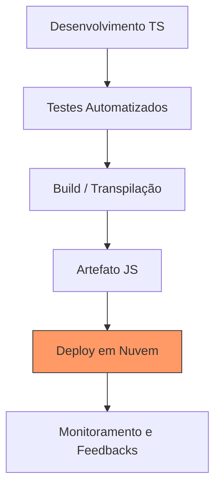

# Aula 16 – Projeto Final e Deploy 🚀

!!! tip "Objetivo"
    Chegamos ao fim da nossa jornada! Nesta aula, consolidaremos tudo o que aprendemos em um projeto completo. Veremos como preparar nosso código para produção, Dockerizar a aplicação e realizar o deploy em nuvem.

---

## 1. O Projeto Final: Sistema de E-commerce Full-Stack 🛒

O desafio final é construir uma API robusta e uma interface simples que se conectem.

### Requisitos Técnicos
- **Tipagem**: 100% dos dados tipados (Interfaces, Types, Enums).
- **Backend**: Node.js + Express com Repository Pattern e Services.
- **Frontend**: React com Hooks e Context API tipados.
- **Segurança**: Validação de dados externos com Zod.
- **Qualidade**: Pelo menos 20% de cobertura de testes unitários com Jest.

---

## 2. Preparando o Build para Produção 🏗️

O código TypeScript não roda diretamente em servidores de produção. Precisamos transpilá-lo para JavaScript.

<div class="termy" data-termynal>
  <span data-ty="input">npm run build</span>
  <span data-ty="progress"></span>
  <span data-ty>Compiling TypeScript...</span>
  <span data-ty>Build success! Files generated in /dist</span>
</div>

!!! warning "Atenção"
    Sempre verifique se a pasta `dist/` está no seu `.gitignore`. Você deve subir o código fonte (`src/`), não o código compilado.

---

## 3. Dockerização (Opcional Profissional) 🐳

O Docker garante que sua aplicação rode da mesma forma em qualquer máquina.

```dockerfile
# Dockerfile
FROM node:18-alpine
WORKDIR /app
COPY package*.json ./
RUN npm install
COPY . .
RUN npm run build
CMD ["node", "dist/index.js"]
```

---

## 4. Estratégias de Deploy 🚀

### Opções Populares:
- **Vercel / Netlify**: Excelentes para o Frontend (React).
- **Railway / Render / Heroku**: Ótimos para o Backend (Node.js).
- **AWS / Google Cloud**: Para projetos de grande escala.

---

## 5. Visualizando o Ciclo de Vida do Projeto (Mermaid)



---

## 6. Exercícios Práticos 📝

1. **Básico**: Execute o comando `tsc` e veja o JavaScript gerado na pasta de saída.
2. **Básico**: Crie um arquivo `.gitignore` que ignore as pastas `node_modules` e `dist`.
3. **Intermediário**: Configure um script no `package.json` chamado `start` que rode o código já compilado.
4. **Intermediário**: Crie um `Dockerfile` básico para sua aplicação Node.js.
5. **Desafio**: Realize o deploy de uma pequena API TypeScript em um serviço gratuito como o Render ou Railway.

---

## 🎓 Conclusão do Curso
Parabéns! Você completou o treinamento **TypeScript Profissional**. Você agora domina uma das linguagens mais requisitadas do mercado e está pronto para construir aplicações escaláveis, seguras e de alta qualidade.

---
**Obrigado por participar!** Continue praticando e explorando a documentação oficial em [typescriptlang.org](https://www.typescriptlang.org/).