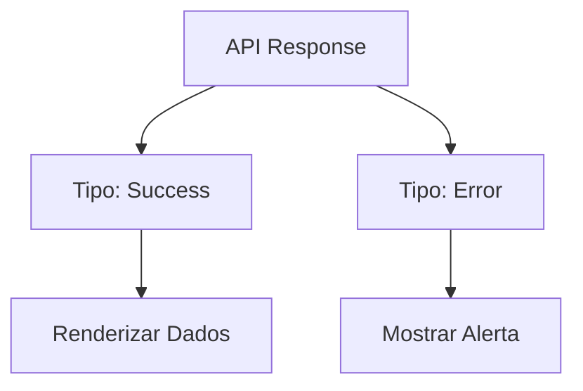

# Aula 03 - Tipos Avançados 🧩

---

## O Desafio da Flexibilidade 🤸
- Nem tudo no mundo é preto no branco (string ou number).
- Às vezes um dado pode ser várias coisas.

---

## Union Types (União) 🤝
- O operador `|` (ou).
- Permite que uma variável aceite mais de um tipo.

```typescript
let id: number | string;
id = 10;
id = "ABC";
```

---

## Uniões na Prática 📦
- Útil para: Status de API, IDs, Cores de tema.

---

## Type Aliases (Apelidos) 🏷️
- Em vez de repetir `string | number`, criamos um nome.

```typescript
type ID = string | number;
let userId: ID = 123;
```

---

## Aliases de Objetos 🏗️
- Organização e legibilidade.

```typescript
type Usuario = {
    nome: string;
    email: string;
};
```

---

## Intersection Types (Interseção) 🔗
- O operador `&` (e).
- Combina tipos existentes em um novo.

```typescript
type Pessoa = { nome: string };
type Admin = { nivel: number };

type SuperUser = Pessoa & Admin;
```

---

## Interseção vs União ⚖️
- **União (`|`)**: Um ou outro. <!-- .element: class="fragment" -->
- **Interseção (`&`)**: Todos juntos. <!-- .element: class="fragment" -->

---

## Literal Types (Literais) 🎯
- Restringe uma variável a valores exatos.

```typescript
type Alinhamento = "esquerda" | "direita" | "centro";
```

---

## Segurança com Literais 🛡️
- Evita erros de digitação (ex: "esquerada").

---

## Narrowing: Estreitando Tipos 🔍
- O TS analisa a lógica do `if` para saber o tipo exato.

```typescript
function processar(id: number | string) {
    if (typeof id === "string") {
        // Aqui o TS sabe que é string!
    }
}
```

---

## Type Guards Reais 🕵️
- Além de `typeof`:
- `instanceof` (para classes) <!-- .element: class="fragment" -->
- Operador `in` (para propriedades) <!-- .element: class="fragment" -->

---

## Funções como Guards 🛡️
- Podemos criar funções que retornam um booleano de tipagem.

```typescript
function isUsuario(obj: any): obj is Usuario {
    return "email" in obj;
}
```

---

## O operador `as` (Type Assertion) ⚠️
- Avisar ao TS: "Pode confiar, eu sei que isso é X".
- Use com cautela!

---

## Non-Null Assertion ‼️
- O ponto de exclamação `!`.
- Garante que algo não é nulo/indefinido.

---

## Discriminated Unions 🆔
- Adicionar um campo "tag" para facilitar a distinção entre tipos em uma união.

```typescript
interface Sucesso { type: "sucesso"; data: string; }
interface Erro { type: "erro"; msg: string; }
```

---

## Exemplo: API Response 📡



---

## Resumo 🏁
- Union e Intersection <!-- .element: class="fragment" -->
- Type Aliases <!-- .element: class="fragment" -->
- Narrowing e Type Guards <!-- .element: class="fragment" -->

---

## Próxima Aula: Interfaces!
### Vamos modelar sistemas complexos. 🚀