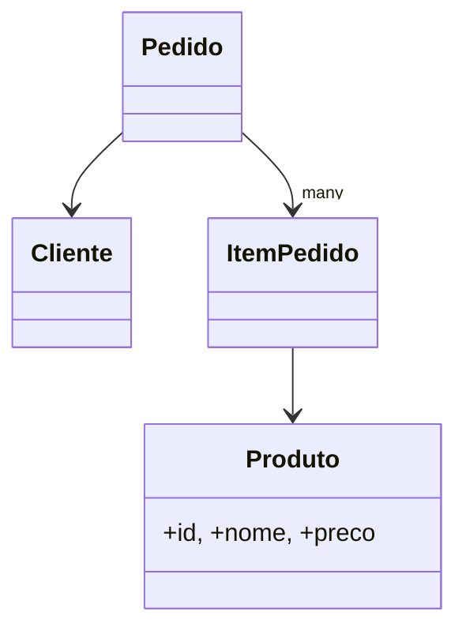

# Aula 04 - Interfaces e Modelagem de Domínio 🏗️

---

## O que são Interfaces? 🧩
- Contratos para o seu código.
- Definem a "forma" de um objeto.

---

## Diferença: Interface vs Type ⚖️
- **Interface**: Focada em objetos e extensibilidade (POO). <!-- .element: class="fragment" -->
- **Type**: Mais flexível (Unions, Primitivos, Interseções). <!-- .element: class="fragment" -->

---

## Sintaxe Básica ✍️

```typescript
interface Usuario {
    nome: string;
    email: string;
}
```

---

## Propriedades Opcionais ❓
- Use `?` para campos que podem não existir.

```typescript
interface Produto {
    nome: string;
    preco: number;
    descricao?: string;
}
```

---

## Propriedades Readonly 🔒
- Proteção contra alterações após a criação.

```typescript
interface Config {
    readonly apiKey: string;
}
```

---

## Extensibilidade (Herança) 🌲
- Interfaces podem herdar de outras.

```typescript
interface Animal { nome: string; }
interface Gato extends Animal { miau: boolean; }
```

---

## Herança Múltipla 🌳
- Sim, uma interface pode estender várias!

```typescript
interface Humano extends Pessoa, Trabalhador {}
```

---

## Implementação em Classes 🏛️
- O contrato que a classe **deve** seguir.

```typescript
class MeuBotao implements BotaoInterface {
    // Deve ter os métodos da interface
}
```

---

## Declaration Merging 🤝
- Interfaces com o mesmo nome na mesma pasta se fundem automaticamente.

---

## Quando usar Merging? 🛠️
- Ideal para estender definições de bibliotecas externas (como adicionar um campo no `Request` do Express).

---

## Modelagem de Domínio 🗺️
- Traduzindo a realidade em interfaces.
- Cliente, Produto, Pedido, Pagamento.

---

## Exemplo: Pedido de Ecommerce 🛒


---

## Interfaces para Funções 📞
- Sim, interfaces podem descrever a assinatura de uma função.

```typescript
interface Calculadora {
    (a: number, b: number): number;
}
```

---

## Boas Práticas de Nomeação ✍️
- Use nomes substantivos (Usuario, Produto).
- A convenção do prefixo `I` (ex: `IUsuario`) é opcional, mas herdada do C#.

---

## Interface vs Model 🏗️
- No TS, usamos interfaces para definir a estrutura dos dados que trafegam na nossa aplicação.

---

## Segurança de Tipo Total 🛡️
- Com interfaces bem definidas, erros de "undefined" somem do seu projeto.

---

## Resumo 🏁
- Definição de Interfaces <!-- .element: class="fragment" -->
- Extensão (extends) <!-- .element: class="fragment" -->
- Interface vs Type Alias <!-- .element: class="fragment" -->

---

## Próxima Aula: Classes e POO!
### Vamos entrar no mundo dos objetos. 🚀

---

## Perguntas? ❓