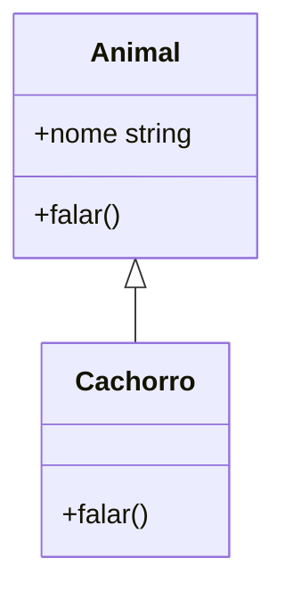

# Aula 05 - Classes e Programação Orientada a Objetos 🏛️

---

## O que é POO? 🧱
- Programação Orientada a Objetos.
- Organizar o código em "moldes" (classes) e "exemplares" (objetos).

---

## Classes no TypeScript 🏗️
- Diferente do JS puro, o TS permite tipar atributos e usar modificadores.

```typescript
class Animal {
    nome: string;
    constructor(nome: string) { this.nome = nome; }
}
```

---

## Modificadores de Acesso 🔑
- **public**: Acesso em qualquer lugar (padrão). <!-- .element: class="fragment" -->
- **private**: Acesso apenas dentro da classe. <!-- .element: class="fragment" -->
- **protected**: Acesso na classe e em suas subclasses. <!-- .element: class="fragment" -->

---

## Shorthand Properties 🏎️
- Mais rápido e limpo!

```typescript
class Pessoa {
    constructor(private nome: string, public idade: number) {}
}
```

---

## Readonly em Classes 🔒
- Propriedades que só podem ser mudadas no construtor.

---

## Getters e Setters 🛡️
- Interceptam o acesso aos dados.

```typescript
get preco() { return this._preco; }
set preco(v: number) { if(v > 0) this._preco = v; }
```

---

## Herança (Extends) 🌲
- Reutilize código de classes base.

```typescript
class Gato extends Animal {
    miar() { console.log("Miau!"); }
}
```

---

## O Método `super()` 🦸
- Chama o construtor da classe pai.
- Obrigatório se a classe filha tiver seu próprio construtor.

---

## Polimorfismo 🎭
- "Muitas formas".
- Uma subclasse pode sobrescrever métodos do pai.

---

## Sobreescrita de Métodos ✍️
```typescript
class Cachorro extends Animal {
    falar() { console.log("Au Au!"); }
}
```

---

## Classes Abstratas ☁️
- Moldes que não podem ser usados sozinhos.
- Servem apenas para serem herdados.

---

## Métodos Abstratos 📋
- O pai define **o que** deve ser feito.
- A filha decide **como** fazer.

---

## Membros Estáticos (`static`) ⚡
- Pertencem à classe, não ao objeto (instância).
- Ex: `Math.random()`.

---

## Diagramas de Classe 📊


---

## Vantagens no TypeScript 💎
- Checagem rigorosa de quem pode acessar o quê.
- Melhores sugestões de refatoração no editor.

---

## Encapsulamento Real 🛡️
- Ocultar complexidade interna e expor apenas o necessário.

---

## Composição vs Herança 🧩
- Dica: Prefira compor objetos pequenos em vez de criar hierarquias gigantes de herança.

---

## Resumo 🏁
- Modificadores (Public, Private, Protected) <!-- .element: class="fragment" -->
- Herança e Polimorfismo <!-- .element: class="fragment" -->
- Classes Abstratas <!-- .element: class="fragment" -->

---

## Próxima Aula: Generics!
### Vamos criar código universal e seguro. 🚀

---

## Perguntas? ❓