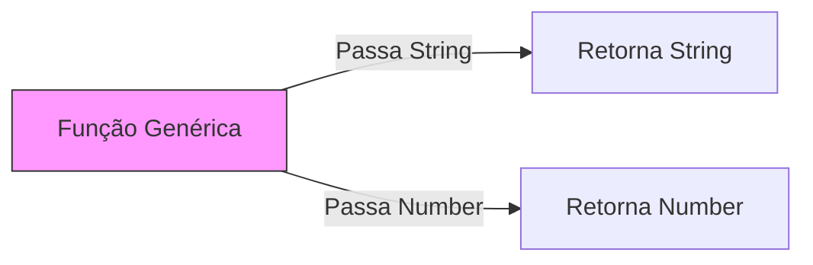

# Aula 06 - Generics (Programação Genérica) 📦

---

## O que são Generics? 🧬
- Componentes que funcionam com vários tipos de dados.
- Mantêm a segurança sem usar `any`.

---

## O Problema do `any` 🌪️
- Perdemos o autocompletar.
- O TypeScript para de nos proteger.

---

## A Sintaxe `<T>` ✍️
- O Diamante (Diamond Operator).
- "T" representa um tipo que será definido depois.

---

## Exemplo: Função Genérica 📞

```typescript
function Identity<T>(arg: T): T {
    return arg;
}
```

---

## Como usar Generics 🛠️
1. Especificando o tipo: `Identity<string>("Olá")`. <!-- .element: class="fragment" -->
2. Deixando o TS inferir: `Identity(10)`. <!-- .element: class="fragment" -->

---

## Generics em Arrays 📚
- Já vimos isso: `Array<string>` é um Generic!

---

## Múltiplos Tipos Genéricos 👥
- Podemos ter mais de um.
- `<T, U, K>`.

```typescript
function par<T, U>(a: T, b: U) { ... }
```

---

## Generic Constraints (Restrições) ⛓️
- Limitar quais tipos podem ser usados.
- Usamos a palavra-chave `extends`.

---

## Exemplo: Restrição de Propriedade 🛡️

```typescript
interface PossuiLength { length: number; }

function logSize<T extends PossuiLength>(arg: T) {
    console.log(arg.length);
}
```

---

## Classes Genéricas 🏗️
- Criar moldes que se adaptam ao dado neles guardado.

```typescript
class Caixa<T> {
    constructor(public conteudo: T) {}
}
```

---

## Interfaces Genéricas 🧩
- Muito comum para respostas de servidores.

```typescript
interface Resposta<T> {
    data: T;
    error: string | null;
}
```

---

## Generics com Valor Padrão 🎁
- Podemos definir um tipo "default".

```typescript
interface Config<T = string> { ... }
```

---

## Por que usar Generics? 💎
- Reutilização de código masiva. <!-- .element: class="fragment" -->
- Tipagem 100% segura. <!-- .element: class="fragment" -->
- Menos código duplicado. <!-- .element: class="fragment" -->

---

## Onde encontramos Generics? 🕵️
- Bancos de dados (Prisma, TypeORM).
- Consumo de APIs (Axios).
- Hooks do React (`useState<User>()`).

---

## Visualizando Generics 📊



---

## Boas Práticas ✍️
- Não use Generics se não for necessário (KISS).
- Use nomes curtos como T, U, V ou descriptivos como TData, TResponse.

---

## Erros Comuns ❌
- Tentar usar métodos específicos de um tipo (ex: `.toUpperCase()`) sem antes de fazer a restrição com `extends`.

---

## Generics vs Unions ⚖️
- Unions: Aceita A ou B. <!-- .element: class="fragment" -->
- Generics: "Prende" o tipo do início ao fim da execução. <!-- .element: class="fragment" -->

---

## Resumo 🏁
- Conceito de Generics <!-- .element: class="fragment" -->
- Constraints (extends) <!-- .element: class="fragment" -->
- Classes e Interfaces Genéricas <!-- .element: class="fragment" -->

---

## Próxima Aula: Utility Types!
### Vamos manipular tipos como magos. 🚀

---

## Perguntas? ❓