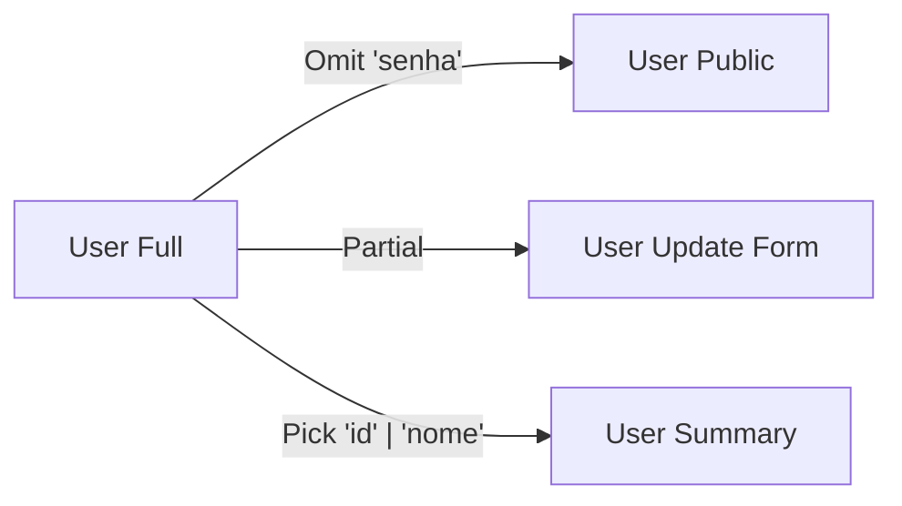

# Aula 07 - Utility Types e Manipulação de Tipos ⚙️

---

## O que são Utility Types? 🛠️
- Atalhos integrados no TypeScript.
- Transformam tipos existentes em novos tipos de forma fácil.

---

## `Partial<T>` (Opcional) ❓
- Torna todas as propriedades de um tipo opcionais.

---

## Exemplo: Update de Usuário 🔄
- Frequentemente usado em formulários de edição onde você só muda alguns campos.

```typescript
function update(id: number, fields: Partial<User>) { ... }
```

---

## `Required<T>` (Obrigatório) ❗️
- O oposto do Partial.
- Garante que todas as propriedades existam, mesmo as marcadas com `?`.

---

## `Readonly<T>` (Imutável) 🔒
- Transformar todas as propriedades em apenas leitura.

---

## Curiosidade 🧠
- `Readonly` só impede a alteração via TypeScript. No JavaScript compilado, o valor ainda pode ser alterado se não usarmos técnicas de JS como `Object.freeze`.

---

## `Pick<T, K>` (Escolher) 🎯
- Selecionar apenas algumas propriedades de um tipo.

```typescript
type UserBasic = Pick<User, "nome" | "email">;
```

---

## `Omit<T, K>` (Omitir) 🚫
- Remove propriedades específicas de um tipo.

```typescript
type UserSemSenha = Omit<User, "senha">;
```

---

## Pick vs Omit ⚖️
- Use `Pick` quando quiser poucas coisas de um tipo grande. <!-- .element: class="fragment" -->
- Use `Omit` quando quiser remover poucas coisas de um tipo grande. <!-- .element: class="fragment" -->

---

## `Record<K, T>` (Mapear) 🗺️
- Criar um objeto de chave-valor bem definido.

```typescript
const roles: Record<number, string> = {
    1: "Admin",
    2: "User"
};
```

---

## `Exclude<T, U>` e `Extract<T, U>` 🔍
- **Exclude**: Remove tipos de uma união.
- **Extract**: Mantém apenas tipos comuns entre uniões.

---

## `ReturnType<T>` 📞
- Captura o tipo de retorno de uma função automaticamente.

---

## Por que usar estes utilitários? 💎
- Evita repetição de código (DRY). <!-- .element: class="fragment" -->
- Se o tipo base mudar, os utilitários se atualizam sozinhos! <!-- .element: class="fragment" -->

---

## Mapped Types: Por debaixo dos panos 🪄
- Os Utility Types usam iteração sobre as chaves do objeto para funcionar.

---

## Visualizando as Transformações 📊



---

## Dica: Documentação Oficial 📚
- O TypeScript possui dezenas de utilitários. Sempre consulte antes de criar um tipo complexo manualmente.

---

## Utility Types em APIs 📡
- Muito útil para filtrar dados sensíveis antes de enviá-los ao frontend.

---

## Refatoração com Utilitários 🛠️
- Reduza suas 200 linhas de interfaces para 50 usando composição e utilitários.

---

## Resumo 🏁
- Partial, Required e Readonly <!-- .element: class="fragment" -->
- Pick e Omit <!-- .element: class="fragment" -->
- Record e ReturnType <!-- .element: class="fragment" -->

---

## Próxima Aula: Manipulação Avançada!
### Vamos ver Keyof, Infer e Conditional Types. 🚀

---

## Perguntas? ❓