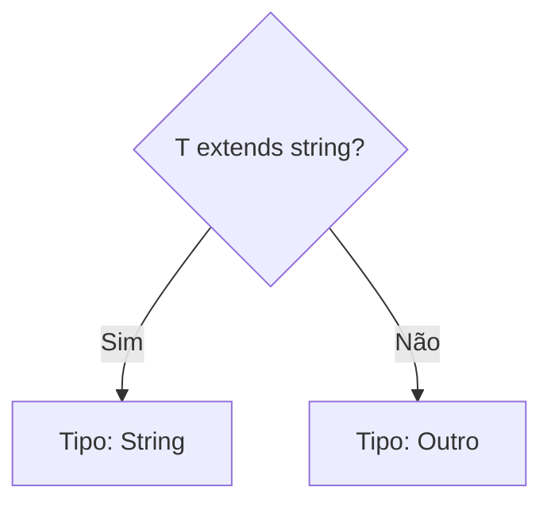

# Aula 08 - Manipulação Avançada de Tipos 🧪

---

## Subindo o Nível 🚀
- Hoje vamos além das interfaces simples.
- Veremos como o TS pode ser dinâmico e "mágico".

---

## O operador `keyof` 🔑
- Extrai todas as chaves (nomes das propriedades) de um tipo.

```typescript
type User = { id: number; nome: string };
type UserKeys = keyof User; // "id" | "nome"
```

---

## `keyof` na Prática 🛠️
- Criar funções que acessam propriedades de objetos com garantia de que a chave existe.

---

## Indexed Access Types 📂
- "Olhar" para o tipo de uma propriedade específica.

```typescript
type NomeTipo = User["nome"]; // string
```

---

## Conditional Types (Se/Então) ⚖️
- Tipos que decidem seu formato baseados em condições.
- Sintaxe: `T extends U ? X : Y`.

---

## Exemplo: Verificação de Tipo 🔍

```typescript
type IsString<T> = T extends string ? "Sim" : "Não";
```

---

## A palavra-chave `infer` 🕵️
- Capturar um tipo de "dentro" de outro durante uma checagem condicional.

---

## Exemplo: Extrair Tipo do Array 📦

```typescript
type GetArrayType<T> = T extends (infer U)[] ? U : T;
```

---

## Template Literal Types 🔠
- Criar uniões de strings dinâmicas usando crases.

```typescript
type Evento = "click" | "hover";
type EventoDinamico = `on${Capitalize<Evento>}`; 
// "onClick" | "onHover"
```

---

## Manipulando Nomes de Propriedades ✍️
- Utilitários: `Uppercase`, `Lowercase`, `Capitalize`, `Uncapitalize`.

---

## Mapped Types Avançados 🗺️
- Mudar o nome das chaves durante a criação do tipo.

```typescript
type Getters<T> = {
    [K in keyof T as `get${Capitalize<string & K>}`]: () => T[K]
};
```

---

## Recursividade em Tipos 🔁
- Um tipo pode chamar a si mesmo! (Cuidado com loops infinitos).

---

## Utilitário: `Exclude` e `Extract` Revisitados 🛠️
- Por baixo dos panos todos eles usam tipos condicionais.

---

## Visualizando Lógica de Tipos 📊



---

## Onde isso é usado? 💎
- Filtros de busca tipados automaticamente. <!-- .element: class="fragment" -->
- Transformadores de dados complexos. <!-- .element: class="fragment" -->
- Frameworks como NestJS e bibliotecas de Schema (Zod). <!-- .element: class="fragment" -->

---

## Por que aprender isso? 🏆
- Para construir ferramentas (libraries) que outros desenvolvedores usarão.
- Para entender as mensagens de erro mais cabulosas do TS.

---

## Dica: Não abuse! 🛑
- Código de tipagem muito complexo pode ser tão difícil de manter quanto código de lógica complexa.

---

## Deep Dive: `infer` 🌊
- Pense no `infer` como uma variável temporária que o TS preenche para você.

---

## Resumo 🏁
- keyof e Acesso Indexado <!-- .element: class="fragment" -->
- Tipos Condicionais e infer <!-- .element: class="fragment" -->
- Template Literal Types <!-- .element: class="fragment" -->

---

## Próxima Aula: Módulos e Organização!
### Vamos organizar nosso caos. 🚀

---

## Perguntas? ❓