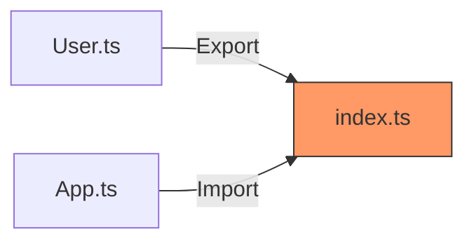

# Aula 09 - Módulos e Organização Profissional 📁

---

## Organizando o Caos 🌪️
- Conforme o projeto cresce, não podemos ter tudo em um arquivo só.
- Precisamos de uma estrutura modular e escalável.

---

## ES Modules (Import/Export) 📦
- O padrão moderno do JavaScript.
- `export`: Disponibilizar algo. <!-- .element: class="fragment" -->
- `import`: Trazer algo de outro arquivo. <!-- .element: class="fragment" -->

---

## Named Exports (Exportações Nomeadas) 🏷️
- Várias exportações por arquivo.

```typescript
export class Usuario {}
export const PI = 3.14;
```

---

## Default Export (Exportação Padrão) 🥇
- Apenas uma por arquivo.
- Não precisa de chaves `{}` ao importar.

---

## Barrel Files (index.ts) 🛢️
- Concentrar exportações de uma pasta em um único ponto.
- Simplifica a vida de quem consome.

---

## Exemplo: Pasta de Controllers 🎮
- Em vez de importar de 5 arquivos, importa tudo do `index.ts`.

---

## Namespaces (Espaços de Nomes) 🏘️
- Uma forma antiga de organizar código TS.
- Evitam colisões de nomes globais.
- Dica: Prefira Módulos para projetos modernos.

---

## Path Aliases (Apelidos de Caminho) 🔗
- Chega de `../../../`.
- Use `@models/Usuario` em vez de caminhos relativos infinitos.

---

## Configurando Aliases ⚙️
- Feito no `tsconfig.json`.

```json
"paths": {
  "@models/*": ["src/models/*"]
}
```

---

## Estrutura de Pastas Profissional 🏗️
```text
src/
  ├── models/
  ├── services/
  ├── controllers/
  ├── routes/
  └── index.ts
```

---

## Módulos de Terceiros 📦
- Instalando tipos: `@types/nome-da-biblioteca`.
- Ex: `@types/node`, `@types/express`.

---

## Tipagem de Bibliotecas Legadas 🕰️
- Como criar seu próprio arquivo `.d.ts` se a biblioteca não tiver tipos.

---

## Declare: O comando de confiança 🤝
- `declare var jQuery: any;`
- Avisa ao TS que algo existe globalmente (ex: via CDN).

---

## Modificadores de Acesso de Módulos 🔒
- Se você não exportar, fica privado ao arquivo.
- Encapsulamento em nível de sistema de arquivos!

---

## Re-exportação 🔄
- `export * from './outro-arquivo';`
- Útil para criar bibliotecas e SDKs.

---

## Visualizando o Fluxo de Módulos 📊



---

## Scripts NPM de Organização 📝
- `lint`: Verificar estilo. <!-- .element: class="fragment" -->
- `format`: Ajustar código automaticamente (Prettier). <!-- .element: class="fragment" -->

---

## Barrel Files: Menos é Mais! ⚖️
- Cuidado com o "Circula Dependency" ao usar Barrel Files em excesso.

---

## Resumo 🏁
- Import / Export <!-- .element: class="fragment" -->
- Barrel Files e Namespaces <!-- .element: class="fragment" -->
- Path Aliases e Organização de Pastas <!-- .element: class="fragment" -->

---

## Próxima Aula: TypeScript com Node.js!
### Vamos para o Backend. 🚀

---

## Perguntas? ❓