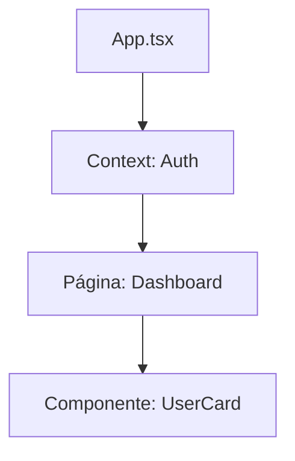

# Aula 11 - TypeScript com Frontend Moderno ⚛️

---

## TypeScript no Navegador 🌐
- Foco em: Componentização e Segurança de Dados.

---

## Por que Frontend + TS? 🚀
- Saber exatamente quais Props um componente recebe. <!-- .element: class="fragment" -->
- Evitar o clássico "undefined is not a function" na UI. <!-- .element: class="fragment" -->
- Estado (State) 100% previsível. <!-- .element: class="fragment" -->

---

## Tipando Props 🧩
- O contrato entre o componente pai e o filho.

```typescript
interface BotaoProps {
    label: string;
    onClick: () => void;
}
```

---

## Componentes Funcionais 🧱
- Como declarar: `const MeuComp = ({ label }: Props) => { ... }`

---

## Hooks: `useState` 🎣
- Inferência vs Explícito.

```typescript
const [user, setUser] = useState<Usuario | null>(null);
```

---

## Hooks: `useRef` 🔍
- Manipulando o DOM com segurança.

```typescript
const inputRef = useRef<HTMLInputElement>(null);
```

---

## Eventos de Formulário 📝
- Tipos específicos: `ChangeEvent`, `FormEvent`.

---

## Context API Tipada 🌍
- Estado global seguro.

```typescript
interface Contexto { tema: string; user: User; }
const GlobalContext = createContext<Contexto | undefined>(undefined);
```

---

## Hooks Customizados Genéricos 🛠️
- `useLocalStorage<T>`: Reutilização total!

---

## Estilização (CSS-in-JS) 🎨
- Tipando temas no Styled Components ou Tailwind.

---

## Consumo de API no Front 📡
- Onde realizar a chamada (useEffect) e como guardar no estado tipado.

---

## Componentes Genéricos de UI 🔘
- Tabelas, Listas e Grids que aceitam qualquer dado.

---

## O operador `as` no DOM ⚠️
- `e.target as HTMLButtonElement`.
- Necessário às vezes para acessar propriedades específicas.

---

## Hierarquia de Componentes 📊



---

## Erros comuns no Frontend ❌
- Esquecer de tipar o `null` inicial do `useState`.

---

## Melhores ferramentas 🛠️
- Vite + TypeScript (O padrão atual).
- ESLint + Prettier.

---

## Tipagem de Bibliotecas UI 📚
- Material UI, Shadcn/UI, Radix.

---

## Testando Componentes 🧪
- Introdução rápida ao Testing Library com TS.

---

## Resumo 🏁
- Props e State Tipados <!-- .element: class="fragment" -->
- Hooks e Context API <!-- .element: class="fragment" -->
- Componentes Genéricos <!-- .element: class="fragment" -->

---

## Próxima Aula: Integração com APIs!
### Vamos conectar tudo. 🚀

---

## Perguntas? ❓