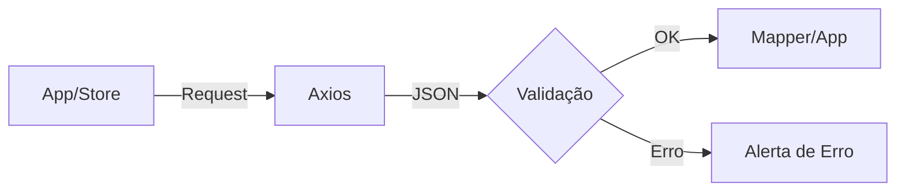

# Aula 12 - Integração com APIs e Tipagem de Dados Externos 📡

---

## O Mundo Externo é Incerto 🌪️
- O TypeScript não roda na internet.
- Dados vindos de APIs podem estar errados ou incompletos.

---

## Fetch e Axios com Generics 🌐
- Informar ao TS o que esperamos receber.

```typescript
const { data } = await axios.get<User>(url);
```

---

## Tipagem de Respostas de API 📥
- Crie interfaces que reflitam EXATAMENTE o JSON da API.

---

## O Padrão DTO Revisitado 🔄
- Diferença entre o que a API envia e o que sua aplicação precisa.

---

## Mapeamento de Dados (Mappers) 🗺️
- Funções que convertem a resposta da API para o seu modelo interno.

---

## Por que mapear? 💎
- Se a API mudar um campo de nome, você só altera o Mapper, não o app inteiro!

---

## Validação em Tempo de Execução 🛡️
- O TypeScript desaparece no build.
- Precisamos de algo que valide os dados **enquanto** o usuário usa o app.

---

## Conhecendo o Zod 🛡️
- Biblioteca de Schema Validation.
- "Criação de tipos que validam".

---

## Exemplo: Schema Zod ✍️

```typescript
const UserSchema = z.object({
  id: z.number(),
  nome: z.string().min(3)
});
```

---

## Inferencia do Zod 🧠
- Gere seu tipo TS a partir do Schema!

```typescript
type User = z.infer<typeof UserSchema>;
```

---

## Tratamento de Erros de Rede ⚠️
- Tipando erros HTTP (404, 500, etc).

---

## Axios Interceptors 🛠️
- Adicionar cabeçalhos (Auth) e tratar erros globalmente com tipagem.

---

## Estado de Loading e Error ⏳
- Criar uniões para representar os estados de uma requisição.

```typescript
type APIStatus = "idle" | "loading" | "success" | "error";
```

---

## Visualizando o Ciclo da Requisição 📊



---

## React Query e SWR ⚡
- Bibliotecas que facilitam a vida com TS, Cache e estados de carregamento.

---

## Tipagem de Parâmetros de Busca (Query Params) 🔍
- `/users?ordenar=nome&limite=10`.

---

## Mocking de APIs para Testes 🎭
- Usando MSW (Mock Service Worker) para simular respostas tipadas.

---

## O Perigo do `any` em APIs 🛑
- NUNCA deixe o retorno da API como `any`. É o lugar onde mais acontecem bugs silenciosos.

---

## Resumo 🏁
- Axios + Generics <!-- .element: class="fragment" -->
- Mapeamento e DTOs <!-- .element: class="fragment" -->
- Validação com Zod <!-- .element: class="fragment" -->

---

## Próxima Aula: Testes com TypeScript!
### Vamos garantir a estabilidade. 🚀

---

## Perguntas? ❓