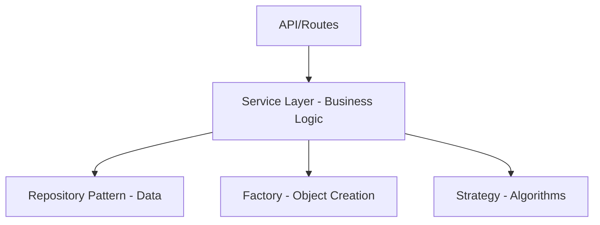

# Aula 14 - Padrões de Projeto com TypeScript 🛡️

---

## Software de Alta Qualidade 🏆
- Não basta funcionar; o código deve ser fácil de manter e evoluir.

---

## O que são Design Patterns? ♟️
- Soluções reutilizáveis para problemas recorrentes no design de arquitetura.

---

## Padrão Repository 🏛️
- Isolar a lógica de persistência de dados.
- O app não sabe se os dados vêm do SQL, Mongo ou Memória.

---

## Implementando um Repository 🏗️
- Use Interfaces para definir o contrato.

```typescript
interface IUserRepository {
  save(user: User): Promise<void>;
}
```

---

## Service Layer 🏗️
- Onde vive a Lógica de Negócio.
- Os serviços orquestram os repositórios.

---

## Dependency Injection (DI) 💉
- Injetar dependências via construtor.
- Classes desacopladas e fáceis de testar.

---

## Factory Pattern 🏭
- Centralizar a lógica de criação de objetos complexos.

```typescript
class PaymentFactory {
  static create(type: string): IPayment { ... }
}
```

---

## Strategy Pattern 🎯
- Trocar algoritmos em tempo de execução.
- Ex: Diferentes formas de cálculo de desconto.

---

## Singleton Pattern 🥇
- Garantir que uma classe tenha apenas uma instância (ex: Configuração, Database).

---

## Observer Pattern 👁️
- Um objeto notifica outros sobre mudanças de estado.

---

## Decorators em TypeScript 🎀
- Adicionar metadados ou comportamentos a classes e métodos de forma elegante (muito usado no NestJS).

---

## Onde usar cada padrão? 🗺️


---

## Vantagens dos Padrões 💎
- Linguagem comum entre desenvolvedores. <!-- .element: class="fragment" -->
- Código mais organizado e previsível. <!-- .element: class="fragment" -->
- Facilidade de expansão. <!-- .element: class="fragment" -->

---

## Composição sobre Herança 🧩
- Use padrões para compor comportamentos em vez de criar cadeias longas de classes pais.

---

## Padrões no Frontend ⚛️
- Custom Hooks (são um tipo de Factory/Service).
- Render Props e HOCs (Padrão Decorator/Wrapper).

---

## Dica: Não "Super-Arquitete" 🛑
- Use padrões apenas quando houver um problema real para resolver. Evite complexidade desnecessária.

---

## Padrões de Criação, Estruturais e Comportamentais 📂
- As três grandes categorias do GoF (Gang of Four).

---

## Resumo 🏁
- Repository e Service <!-- .element: class="fragment" -->
- Injeção de Dependência <!-- .element: class="fragment" -->
- Factory e Strategy <!-- .element: class="fragment" -->

---

## Próxima Aula: Clean Code e Arquitetura!
### O refino final do seu código. 🚀

---

## Perguntas? ❓