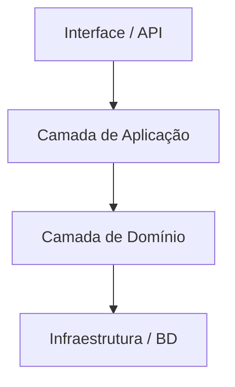

# Aula 15 - Clean Code e Arquitetura 📐

---

## Código para Humanos 👥
- "Qualquer tolo consegue escrever código que um computador entenda. Bons programadores escrevem código que humanos entendam."

---

## O que é Clean Code? ✨
- Um código que se lê como uma prosa bem escrita.

---

## Princípios SOLID 💎
Cinco pilares da arquitetura orientada a objetos:
- **S**ingle Responsibility <!-- .element: class="fragment" -->
- **O**pen/Closed <!-- .element: class="fragment" -->
- **L**iskov Substitution <!-- .element: class="fragment" -->
- **I**nterface Segregation <!-- .element: class="fragment" -->
- **D**ependency Inversion <!-- .element: class="fragment" -->

---

## S: Responsabilidade Única 🎯
- Uma classe/função deve ter apenas UM motivo para mudar.

---

## O: Aberto para Extensão, Fechado para Mudança 🔓
- Adicione novas funcionalidades sem quebrar o que já existe.

---

## I: Segregação de Interfaces 🧩
- Interfaces pequenas e específicas são melhores que interfaces "gordas".

---

## D: Inversão de Dependência 💉
- Dependa de abstrações, não de implementações.

---

## DRY: Don't Repeat Yourself 🔁
- Evite duplicar lógica em vários lugares.

---

## KISS: Keep It Simple, Stupid! 🧠
- Não complique o que pode ser simples.

---

## YAGNI: You Ain't Gonna Need It 🚫
- Não adicione funcionalidades "para o futuro" que você ainda não precisa.

---

## Nomes Significativos ✍️
- Variáveis e funções devem dizer o que fazem sem precisar de comentários.

---

## Funções Pequenas 🤏
- Máximo de 20 linhas.
- Se a função está grande, ela provavelmente faz coisas demais.

---

## Comentários: O Mal Necessário ⚠️
- Se você precisa comentar o que o código faz, o código não está limpo o suficiente. Comente o "porquê" de decisões complexas.

---

## Arquitetura em Camadas 🏢

---

## DDD: Domain-Driven Design 🗺️
- O coração do software é o Domínio (regras de negócio).

---

## Entidades e Value Objects 💎
- **Entidades**: Têm ID (Ex: Usuário).
- **Value Objects**: Definidos pelos seus atributos (Ex: Endereço).

---

## Refatoração Contínua 🧹
- Aplique a "Regra do Escoteiro": Deixe o código sempre um pouco melhor do que o encontrou.

---

## Dívida Técnica 💸
- Código "sujo" hoje é juros que você pagará amanhã em forma de bugs e lentidão.

---

## Resumo 🏁
- Princípios SOLID <!-- .element: class="fragment" -->
- Regras de Clean Code (Nomes, Tamanho) <!-- .element: class="fragment" -->
- Arquitetura em Camadas <!-- .element: class="fragment" -->

---

## Próxima Aula: Projeto Final e Deploy!
### Vamos colocar tudo no ar. 🚀

---

## Perguntas? ❓