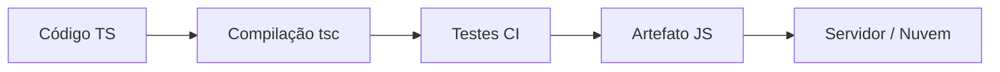

# Aula 16 - Projeto Final e Deploy 🚀

---

## O Grand Finale! 🎓
- Hora de colocar em prática tudo o que aprendemos.

---

## O Projeto: E-commerce Fullstack 🛒
- Backend: Node.js + Express + TS. <!-- .element: class="fragment" -->
- Frontend: React + Hooks + TS. <!-- .element: class="fragment" -->
- Integração: Axios + Zod. <!-- .element: class="fragment" -->
- Qualidade: Jest. <!-- .element: class="fragment" -->

---

## O Ciclo da Produção 🏗️



---

## Preparando o Build 📦
- O comando: `npm run build`.
- Gerando a pasta `dist/`.

---

## Scripts de Produção 📝
- `start`: Executar o código compilado com `node`.

---

## Variáveis de Ambiente (.env) 🗝️
- Senhas de banco, portas do servidor, chaves de API.
- Nunca envie seu `.env` para o Git!

---

## Dockerizando a Aplicação 🐳
- Padronização total do ambiente.

```dockerfile
# Exemplo básico
FROM node:18
WORKDIR /app
COPY . .
RUN npm install && npm run build
CMD ["node", "dist/index.js"]
```

---

## Deploy Frontend 🌐
- Hostings Estáticos: Vercel, Netlify.
- Alta performance via CDNs globais.

---

## Deploy Backend 🖥️
- Plataformas: Railway, Render, AWS, Heroku.

---

## Continuous Deployment (CD) 🔄
- Push no GitHub = Deploy automático.

---

## Monitoramento e Logs 📊
- Saber quando o site cai e por que.

---

## Documentação Final 📖
- O `README.md` é a vitrine do seu projeto.
- Inclua instruções de como rodar e quais tecnologias usou.

---

## Dicas para o Carreira 💼
- Coloque o código no seu Portfolio / GitHub.
- Mostre que você usa TypeScript Profissionalmente.

---

## Além do Curso 🚀
- O aprendizado nunca para!
- Explore: NestJS, Next.js, GraphQL, Microservices.

---

## Parabéns! 🎉
- Você agora domina o TypeScript Profissional.

---

## Vamos para a Apresentação? 📊
- Mostre seu projeto para a turma.

---

## Resumo 🏁
- Estrutura de Build <!-- .element: class="fragment" -->
- Docker e Nuvem <!-- .element: class="fragment" -->
- Projeto Completo <!-- .element: class="fragment" -->

---

## Obrigado! ❤️
### Continue codando e evoluindo.

---

## Perguntas Finais? ❓