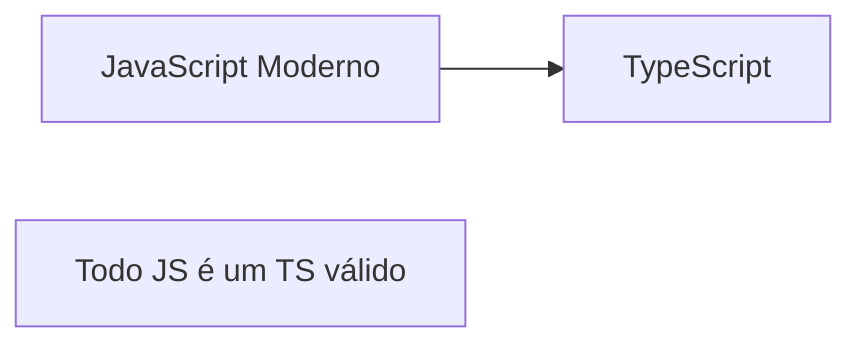

# Aula 01 - Introdução ao TypeScript e Setup Profissional 🧠

---

## Bem-vindos ao Curso! 🚀
### "TypeScript Profissional"

---

## O que vamos ver hoje? 📋
- Evolução do JavaScript
- Problemas da tipagem dinâmica
- O que é TypeScript?
- Setup do Ambiente Real
- Compilação e Watch Mode

---

## O Problema: JavaScript Puro 🌪️
- Tipagem Dinâmica: Liberdade vs. Caos
- Erros que só aparecem em Proteção
- `Cannot read property 'x' of undefined`
- Falta de autocompletar e confiança

---

## A Solução: TypeScript 🛡️
- Criado pela Microsoft
- Adiciona **Tipagem Estática**
- É um **Superset** do JavaScript
- Detecta erros antes de rodar o código

---

## O Conceito de Superset 🧱



---

## Estático vs Dinâmico ⚖️
- **JS**: Tipos são checados no Navegador (Runtime) <!-- .element: class="fragment" -->
- **TS**: Tipos são checados no Editor/Compilador (Compile-time) <!-- .element: class="fragment" -->

---

## Benefícios Reais 💎
- **Documentação Viva**: O código diz o que ele faz <!-- .element: class="fragment" -->
- **Refatoração Segura**: Mude o nome de algo e o TS avisa onde quebrou <!-- .element: class="fragment" -->
- **Produtividade**: Autocompletar inteligente (IntelliSense) <!-- .element: class="fragment" -->

---

## Setup do Ambiente 🛠️
- Precisamos do Node.js instalado
- Gerenciador de pacotes: NPM ou Yarn

---

## Instalando o Compilador 📥

<div class="termy" data-termynal>
  <span data-ty="input">npm install -g typescript</span>
  <span data-ty="input">tsc --version</span>
</div>

---

## Criando seu Primeiro Projeto 📂

<div class="termy" data-termynal>
  <span data-ty="input">mkdir meu-projeto && cd meu-projeto</span>
  <span data-ty="input">npm init -y</span>
  <span data-ty="input">tsc --init</span>
</div>

---

## O arquivo `tsconfig.json` ⚙️
- O cérebro do compilador
- Define como o código será transformado
- Ativa ou desativa regras de segurança

---

## Propriedades Essenciais: `target` 🎯
- Define a versão do JavaScript gerada
- `es5`, `es6`, `esnext`...

---

## Propriedades Essenciais: `rootDir` e `outDir` 🏗️
- **rootDir**: Onde fica o seu código TS (`src`) <!-- .element: class="fragment" -->
- **outDir**: Onde o JS compilado vai parar (`dist`) <!-- .element: class="fragment" -->

---

## O Modo Estrito (`strict`) 🚨
- `true` por padrão (Recomendado!)
- Impede o uso de `any` implícito
- Garante checagem de `null` e `undefined`

---

## Escrevendo Código ✍️

```typescript
// app.ts
const saudacao: string = "Olá TypeScript!";
console.log(saudacao);
```

---

## Compilando o Código 🏗️

<div class="termy" data-termynal>
  <span data-ty="input">npx tsc</span>
  <span data-ty>Gerando dist/app.js...</span>
</div>

---

## Verificando o Resultado 🔍
- O arquivo `.js` gerado não possui tipos
- É JavaScript puro pronto para o navegador ou Node

---

## Watch Mode: Agilidade ⚡
- Não precisa rodar `tsc` toda hora

<div class="termy" data-termynal>
  <span data-ty="input">npx tsc -w</span>
</div>

---

## Ferramenta Bônus: `ts-node` 🏎️
- Roda o código TS direto no terminal sem gerar arquivos
- Ótimo para testes rápidos

---

## Resumo da Aula 🏁
- TS = JS + Tipos <!-- .element: class="fragment" -->
- Setup: Node + TSC <!-- .element: class="fragment" -->
- Configuração: tsconfig.json <!-- .element: class="fragment" -->

---

## Próxima Aula: Tipos Fundamentais!
### Vamos dominar a base da linguagem. 🚀

---

## Perguntas? ❓