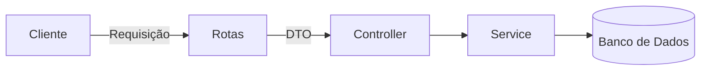

# Aula 10 - TypeScript com Node.js (Backend) 🟢

---

## TypeScript no Servidor 🖥️
- Segurança total desde a requisição até o banco de dados.

---

## Setup de um Projeto Backend 🛠️
- Instalar: `express`, `ts-node-dev`, `@types/node`, `@types/express`.

---

## Por que Node + TS? 🚀
- Autocompletar nos métodos do Express. <!-- .element: class="fragment" -->
- Refatoração de APIs de larga escala. <!-- .element: class="fragment" -->
- Redução de erros 500 (Internal Server Error). <!-- .element: class="fragment" -->

---

## Configurando o Servidor 📡

```typescript
import express, { Request, Response } from 'express';
const app = express();
```

---

## Tipando Requisições (Request) 📥
- Garantir que o `body` ou `params` tenham o formato correto.

```typescript
interface UserBody { nome: string; }
app.post('/', (req: Request<{}, {}, UserBody>, res: Response) => { ... });
```

---

## Tipando Respostas (Response) 📤
- Forçar que sua API retorne sempre o mesmo padrão JSON.

---

## O uso de DTOs 🔄
- **Data Transfer Object**.
- Simplesmente um tipo que define o que entra e o que sai da aplicação.

---

## Camada de Serviços (Services) 🏗️
- Tire a lógica de dentro da rota!
- Crie classes de serviço tipadas.

---

## Middlewares Tipados 🛡️
- Autenticação e logs.
- O uso da `NextFunction`.

---

## Tratamento de Erros Profissional ⚠️
- Criar classes de erro customizadas (AppError).
- Middleware global de erros para capturar tudo de forma tipada.

---

## Banco de Dados com TS 💾
- Ferramentas modernas: **Prisma** ou **TypeORM**.
- Elas geram os tipos automaticamente a partir do seu esquema!

---

## Exemplo: Fluxo de Dados Backend 📊


---

## Scripts de Desenvolvimento 📝
- `"dev": "ts-node-dev --respawn --transpile-only src/server.ts"`

---

## Variáveis de Ambiente Tipadas 🗝️
- Como garantir que seu `process.env` tenha as chaves necessárias.

---

## Deploy de Código Backend 🚀
- Transpilação com `tsc`.
- Execução com `node dist/server.js`.

---

## Performance: --transpile-only 🏎️
- Em desenvolvimento, ignoramos os erros de tipo para rodar mais rápido; o editor já nos avisou antes!

---

## CORS e Segurança 🔒
- Tipando as configurações de Cross-Origin.

---

## Documentação Automática (Swagger) 📖
- Como gerar docs a partir dos seus tipos TS.

---

## Resumo 🏁
- Express + TS Setup <!-- .element: class="fragment" -->
- Tipagem de Request/Response <!-- .element: class="fragment" -->
- Organização em Middlewares e Services <!-- .element: class="fragment" -->

---

## Próxima Aula: TypeScript com Frontend Moderno!
### Vamos para o React. 🚀

---

## Perguntas? ❓