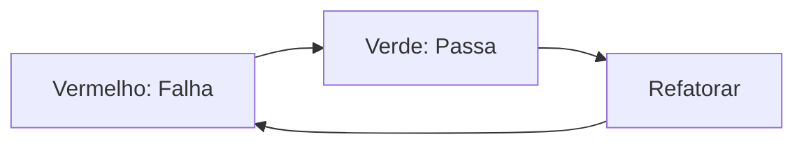

# Aula 13 - Testes com TypeScript 🧪

---

## Por que Testar? 🛡️
- Garantir que o código faz o que deve fazer. <!-- .element: class="fragment" -->
- Evitar que bugs antigos voltem (regressão). <!-- .element: class="fragment" -->
- Confiança para refatorar. <!-- .element: class="fragment" -->

---

## O Ecossistema Jest 🎪
- Jest: O framework de testes "tudo em um".
- `ts-jest`: O motor que permite rodar TS no Jest.

---

## Tipos de Teste 🧱
1. **Unitário**: Pequenas partes (funções). <!-- .element: class="fragment" -->
2. **Integração**: Várias partes juntas (API + DB). <!-- .element: class="fragment" -->
3. **E2E (Ponta a Ponta)**: O fluxo completo do usuário no navegador. <!-- .element: class="fragment" -->

---

## Anatomia de um Teste 🔍

```typescript
describe('Calculadora', () => {
  it('deve somar dois números', () => {
    expect(somar(2, 2)).toBe(4);
  });
});
```

---

## Configurando o Jest ⚙️
- `jest.config.js`
- Preset: `ts-jest`.

---

## Testando Funções Assíncronas ⏳
- `async/await` nos testes.

```typescript
it('deve buscar dados', async () => {
    const data = await api.get();
    expect(data).toBeDefined();
});
```

---

## O Poder dos Mocks 🎭
- Simular dependências que não queremos usar nos testes (ex: banco de dados real).

---

## Mockando Módulos 🧩

```typescript
jest.mock('./api');
const mockedApi = api as jest.Mocked<typeof api>;
```

---

## Spies (Espiões) 🕵️
- Verificar se uma função foi chamada, quantas vezes e com quais argumentos.

---

## Testando Erros ⚠️
- Garantir que seu código lança as exceções corretas nos momentos certos.

---

## Cobertura de Código (Coverage) 📊
- Saber quais partes do projeto ainda não foram testadas.

---

## Testes de Integração com Supertest 🔗
- Testar rotas do Express sem precisar subir o servidor de verdade.

---

## Hooks de Teste 🪝
- `beforeEach`: Rodar algo antes de cada teste (ex: limpar banco).
- `afterAll`: Rodar após tudo (ex: fechar conexões).

---

## TDD (Test Driven Development) 🔄
- Escrever o teste **antes** do código.



---

## Vantagens no TypeScript 💎
- O próprio compilador já é um "teste de tipo" constante.
- Os testes unitários focam na **lógica**, enquanto o TS foca nos **contratos**.

---

## Testando o Frontend (React) ⚛️
- React Testing Library.
- Focar no comportamento do usuário, não na implementação.

---

## CI/CD e Testes 🚀
- Rodar os testes automaticamente em cada `git push`.

---

## Dica: Testes Legíveis 📖
- O nome do teste deve ser uma frase que explique o cenário e o resultado esperado.

---

## Resumo 🏁
- Jest e ts-jest <!-- .element: class="fragment" -->
- Mocks e Spies <!-- .element: class="fragment" -->
- TDD e Integração <!-- .element: class="fragment" -->

---

## Próxima Aula: Padrões de Projeto!
### Vamos arquitetar como profissionais. 🚀

---

## Perguntas? ❓